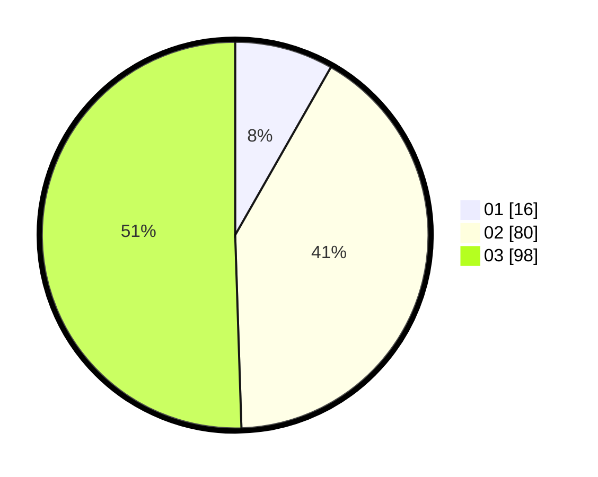

# Hasil

Hasil perolehan suara paslon dapat dilihat pada file paslon-01.txt, paslon-02.txt, dan paslon-03.txt.

Jika tidak ada, artinya data tersebut belum ada pada SIREKAP.

## Perolehan Suara

 * Paslon 01: **16**.
 * Paslon 02: **80**.
 * Paslon 03: **98**.

## Foto C Plano

https://sirekap-obj-formc.kpu.go.id/361f/pemilu/ppwp/31/75/03/10/03/3175031003030-20240218-114240--5f938671-dcd4-4741-a0d4-2be5fea052db.jpg

https://sirekap-obj-formc.kpu.go.id/361f/pemilu/ppwp/31/75/03/10/03/3175031003030-20240218-114242--d79d8af8-de4a-447a-9c71-510cedcaad66.jpg

https://sirekap-obj-formc.kpu.go.id/361f/pemilu/ppwp/31/75/03/10/03/3175031003030-20240218-114241--58ee33bd-92bb-4c85-b545-d39699050de2.jpg

## DATA PEMILIH TETAP

Jumlah pemilih dalam DPT: **0**.
 * L: **0**.
 * P: **0**.

## DATA PENGGUNA HAK PILIH

Jumlah pengguna hak pilih dalam DPT: **0**.
 * L: **0**.
 * P: **0**.

Jumlah pengguna hak pilih dalam DPTb: **0**.
 * L: **0**.
 * P: **0**.

Jumlah pengguna hak pilih dalam DPK: **0**.
 * L: **0**.
 * P: **0**.

Jumlah pengguna hak pilih: **0**.
 * L: **0**.
 * P: **0**.

## JUMLAH SUARA SAH DAN TIDAK SAH

JUMLAH SELURUH SUARA SAH: **194**.

JUMLAH SUARA TIDAK SAH: **6**.

JUMLAH SELURUH SUARA SAH DAN SUARA TIDAK SAH: **200**.
