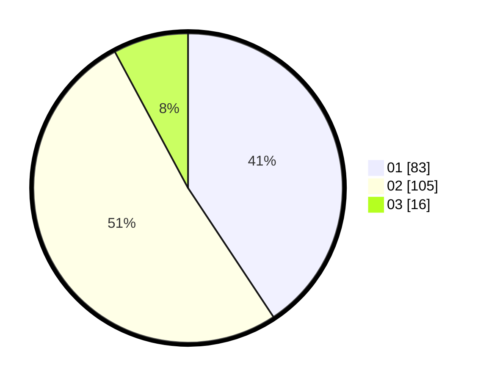

# Hasil

Hasil perolehan suara paslon dapat dilihat pada file paslon-01.txt, paslon-02.txt, dan paslon-03.txt.

Jika tidak ada, artinya data tersebut belum ada pada SIREKAP.

## Perolehan Suara

 * Paslon 01: **83**.
 * Paslon 02: **105**.
 * Paslon 03: **16**.

## Foto C Plano

https://sirekap-obj-formc.kpu.go.id/94d4/pemilu/ppwp/31/75/03/10/03/3175031003032-20240214-220646--d3908e3d-5139-45d7-a0ab-ec3a344a9f63.jpg

https://sirekap-obj-formc.kpu.go.id/94d4/pemilu/ppwp/31/75/03/10/03/3175031003032-20240214-220716--1b5f308b-c986-4fa1-95d6-8659836f52a9.jpg

https://sirekap-obj-formc.kpu.go.id/94d4/pemilu/ppwp/31/75/03/10/03/3175031003032-20240214-220754--45f32b18-4431-4b17-bba1-82146cf1c7d5.jpg

## DATA PEMILIH TETAP

Jumlah pemilih dalam DPT: **285**.
 * L: **132**.
 * P: **153**.

## DATA PENGGUNA HAK PILIH

Jumlah pengguna hak pilih dalam DPT: **555**.
 * L: **555**.
 * P: **555**.

Jumlah pengguna hak pilih dalam DPTb: **9**.
 * L: **3**.
 * P: **6**.

Jumlah pengguna hak pilih dalam DPK: **3**.
 * L: **0**.
 * P: **3**.

Jumlah pengguna hak pilih: **207**.
 * L: **0**.
 * P: **0**.

## JUMLAH SUARA SAH DAN TIDAK SAH

JUMLAH SELURUH SUARA SAH: **204**.

JUMLAH SUARA TIDAK SAH: **4**.

JUMLAH SELURUH SUARA SAH DAN SUARA TIDAK SAH: **208**.
