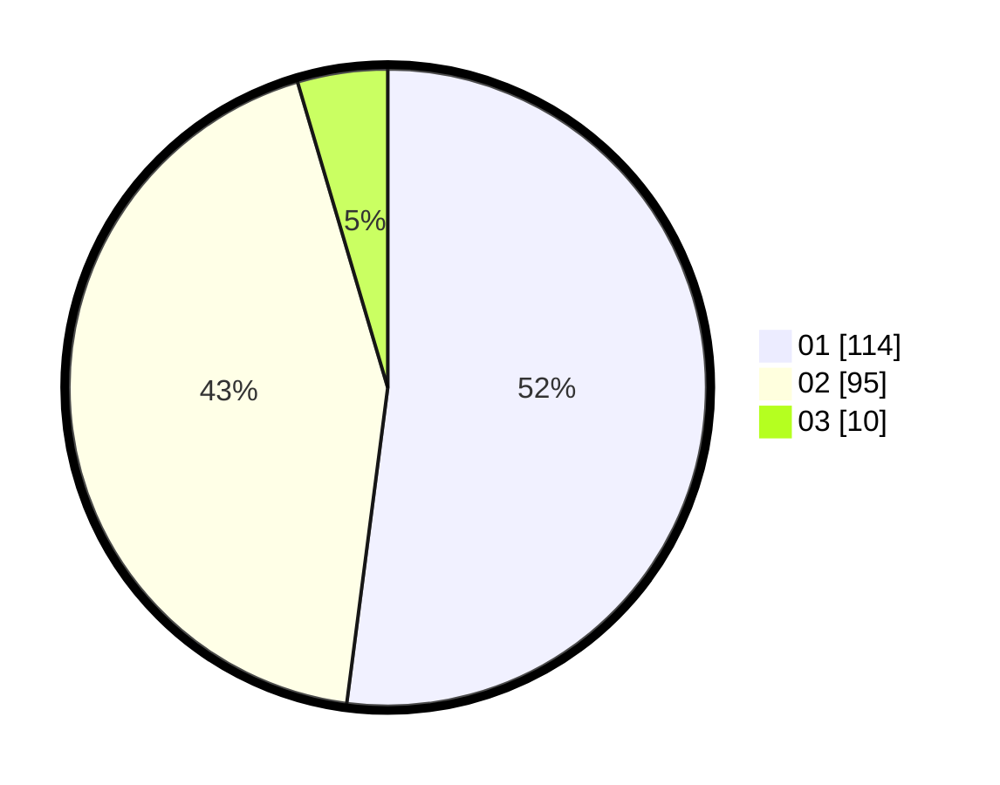

# Hasil

Hasil perolehan suara paslon dapat dilihat pada file paslon-01.txt, paslon-02.txt, dan paslon-03.txt.

Jika tidak ada, artinya data tersebut belum ada pada SIREKAP.

## Perolehan Suara

 * Paslon 01: **114**.
 * Paslon 02: **95**.
 * Paslon 03: **10**.

## Foto C Plano

https://sirekap-obj-formc.kpu.go.id/bce8/pemilu/ppwp/31/75/03/10/04/3175031004031-20240214-214130--a4043907-2159-4775-b9e6-d5dc878ef4b8.jpg

https://sirekap-obj-formc.kpu.go.id/bce8/pemilu/ppwp/31/75/03/10/04/3175031004031-20240214-214243--04edd34f-e7f6-47fe-b85d-9ce4144fb3b8.jpg

https://sirekap-obj-formc.kpu.go.id/bce8/pemilu/ppwp/31/75/03/10/04/3175031004031-20240214-214410--e6bb9da1-a25b-424a-9890-263c9057f210.jpg
