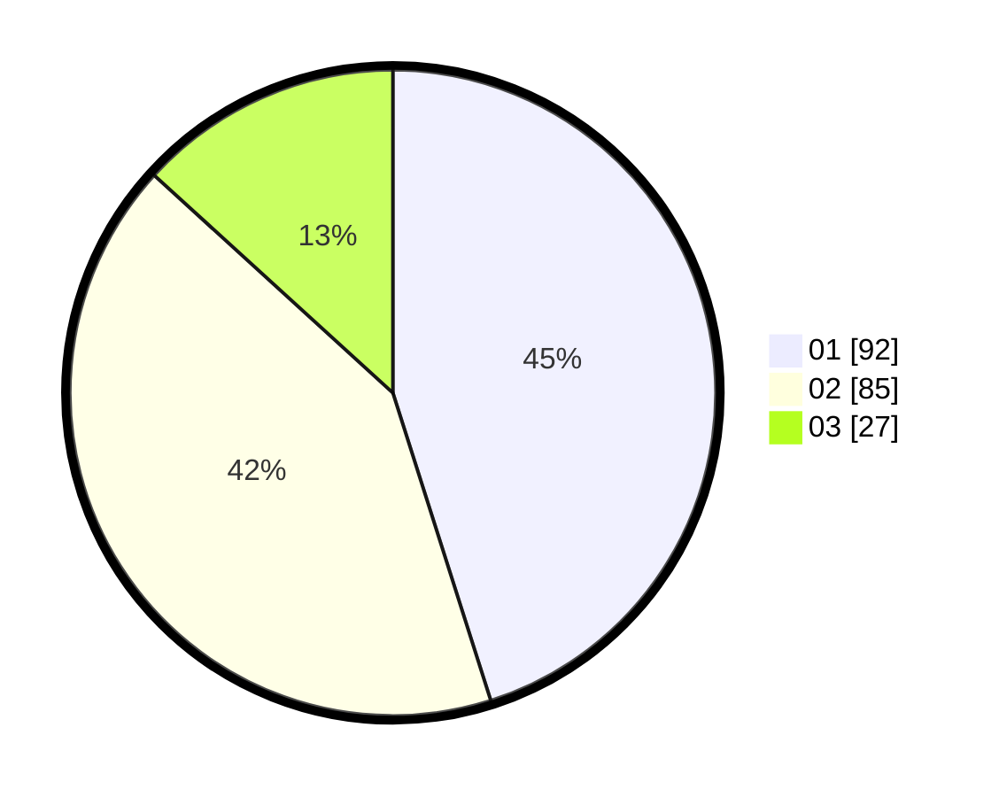

# Hasil

Hasil perolehan suara paslon dapat dilihat pada file paslon-01.txt, paslon-02.txt, dan paslon-03.txt.

Jika tidak ada, artinya data tersebut belum ada pada SIREKAP.

## Perolehan Suara

 * Paslon 01: **92**.
 * Paslon 02: **85**.
 * Paslon 03: **27**.

## Foto C Plano

https://sirekap-obj-formc.kpu.go.id/0813/pemilu/ppwp/31/75/03/10/04/3175031004043-20240214-190657--a84f932e-d73b-4de6-94da-f9348de4bf47.jpg

https://sirekap-obj-formc.kpu.go.id/0813/pemilu/ppwp/31/75/03/10/04/3175031004043-20240214-190450--7335c502-a418-43aa-99f6-4fda3f5b432c.jpg
