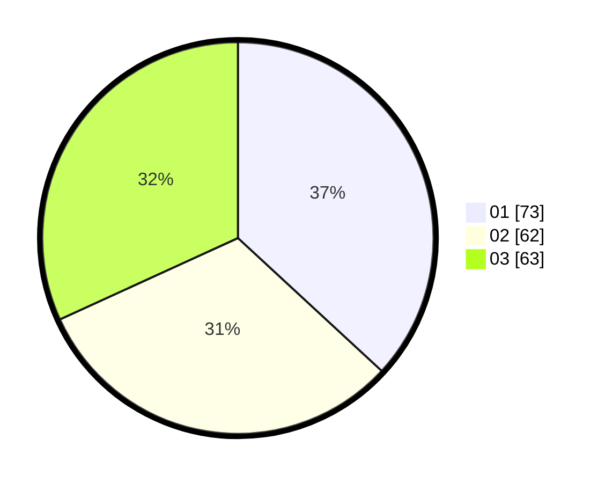

# Hasil

Hasil perolehan suara paslon dapat dilihat pada file paslon-01.txt, paslon-02.txt, dan paslon-03.txt.

Jika tidak ada, artinya data tersebut belum ada pada SIREKAP.

## Perolehan Suara

 * Paslon 01: **73**.
 * Paslon 02: **62**.
 * Paslon 03: **63**.

## Foto C Plano

https://sirekap-obj-formc.kpu.go.id/7a64/pemilu/ppwp/31/75/03/10/04/3175031004051-20240214-184456--5222a99b-fa36-4aa8-a888-e6e1c7d13d97.jpg

https://sirekap-obj-formc.kpu.go.id/7a64/pemilu/ppwp/31/75/03/10/04/3175031004051-20240214-184519--023f7010-3c52-45f6-b19b-77e1876a47fe.jpg

https://sirekap-obj-formc.kpu.go.id/7a64/pemilu/ppwp/31/75/03/10/04/3175031004051-20240214-184602--90aa2ddb-2f6a-40ae-bf02-9f3dc8ddc027.jpg

## DATA PEMILIH TETAP

Jumlah pemilih dalam DPT: **254**.
 * L: **111**.
 * P: **143**.

## DATA PENGGUNA HAK PILIH

Jumlah pengguna hak pilih dalam DPT: **192**.
 * L: **80**.
 * P: **112**.

Jumlah pengguna hak pilih dalam DPTb: **7**.
 * L: **3**.
 * P: **4**.

Jumlah pengguna hak pilih dalam DPK: **1**.
 * L: **0**.
 * P: **1**.

Jumlah pengguna hak pilih: **200**.
 * L: **83**.
 * P: **117**.

## JUMLAH SUARA SAH DAN TIDAK SAH

JUMLAH SELURUH SUARA SAH: **198**.

JUMLAH SUARA TIDAK SAH: **2**.

JUMLAH SELURUH SUARA SAH DAN SUARA TIDAK SAH: **200**.
