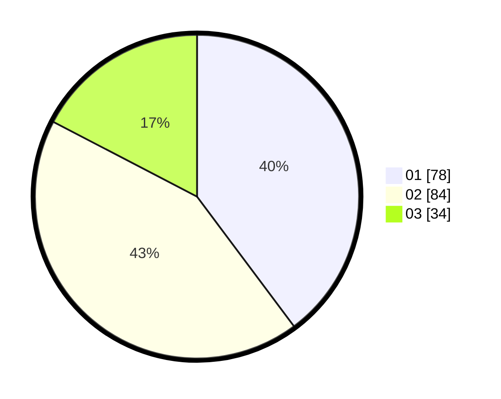

# Hasil

Hasil perolehan suara paslon dapat dilihat pada file paslon-01.txt, paslon-02.txt, dan paslon-03.txt.

Jika tidak ada, artinya data tersebut belum ada pada SIREKAP.

## Perolehan Suara

 * Paslon 01: **78**.
 * Paslon 02: **84**.
 * Paslon 03: **34**.

## Foto C Plano

https://sirekap-obj-formc.kpu.go.id/bea6/pemilu/ppwp/31/75/03/10/05/3175031005004-20240216-041427--266b952b-c700-48c9-8af0-cabe76364238.jpg

https://sirekap-obj-formc.kpu.go.id/bea6/pemilu/ppwp/31/75/03/10/05/3175031005004-20240216-041440--9dbc480d-493c-446a-a0d3-26867cc765c3.jpg

https://sirekap-obj-formc.kpu.go.id/bea6/pemilu/ppwp/31/75/03/10/05/3175031005004-20240216-041435--de423378-07b0-4baf-a3bb-944f47d6c887.jpg

## DATA PEMILIH TETAP

Jumlah pemilih dalam DPT: **264**.
 * L: **128**.
 * P: **136**.

## DATA PENGGUNA HAK PILIH

Jumlah pengguna hak pilih dalam DPT: **196**.
 * L: **94**.
 * P: **102**.

Jumlah pengguna hak pilih dalam DPTb: **2**.
 * L: **0**.
 * P: **2**.

Jumlah pengguna hak pilih dalam DPK: **3**.
 * L: **1**.
 * P: **2**.

Jumlah pengguna hak pilih: **201**.
 * L: **95**.
 * P: **106**.

## JUMLAH SUARA SAH DAN TIDAK SAH

JUMLAH SELURUH SUARA SAH: **196**.

JUMLAH SUARA TIDAK SAH: **5**.

JUMLAH SELURUH SUARA SAH DAN SUARA TIDAK SAH: **201**.
