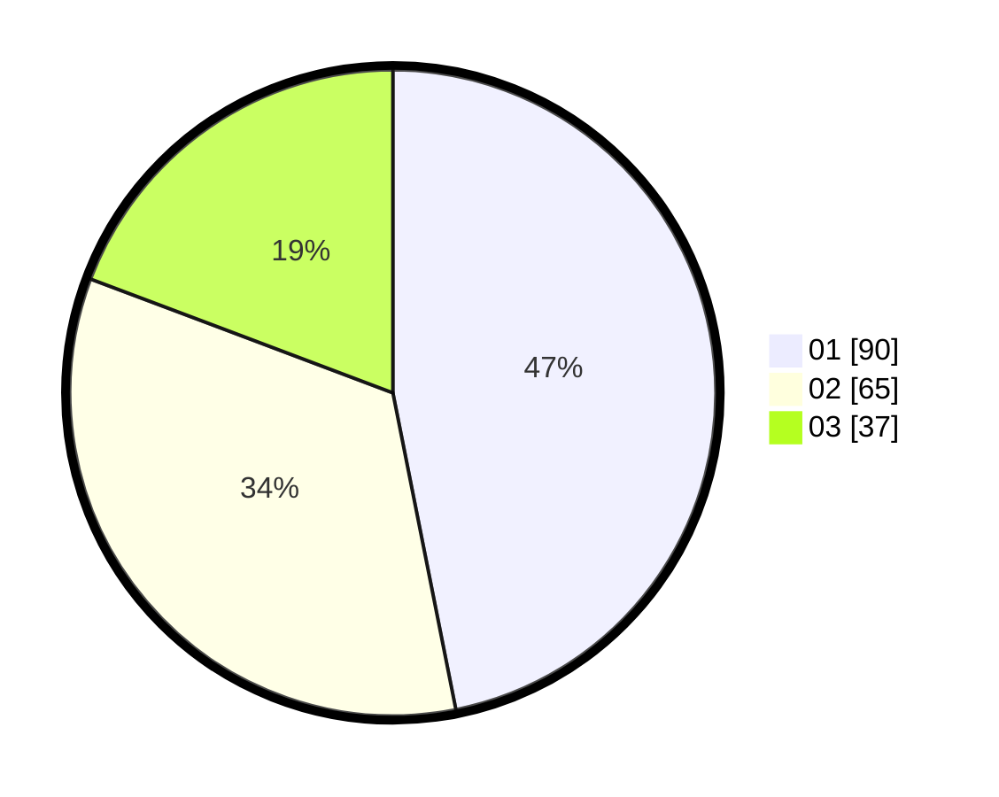

# Hasil

Hasil perolehan suara paslon dapat dilihat pada file paslon-01.txt, paslon-02.txt, dan paslon-03.txt.

Jika tidak ada, artinya data tersebut belum ada pada SIREKAP.

## Perolehan Suara

 * Paslon 01: **90**.
 * Paslon 02: **65**.
 * Paslon 03: **37**.

## Foto C Plano

https://sirekap-obj-formc.kpu.go.id/f731/pemilu/ppwp/31/75/03/10/05/3175031005006-20240215-003454--ec48c1ab-786e-4c9e-847b-38dc9e4a61b5.jpg

https://sirekap-obj-formc.kpu.go.id/f731/pemilu/ppwp/31/75/03/10/05/3175031005006-20240215-003052--bcf29b09-c3b6-417b-a7a7-49288cece203.jpg

https://sirekap-obj-formc.kpu.go.id/f731/pemilu/ppwp/31/75/03/10/05/3175031005006-20240215-002957--cbfe86f6-2110-4daa-908a-b7336123b50f.jpg
