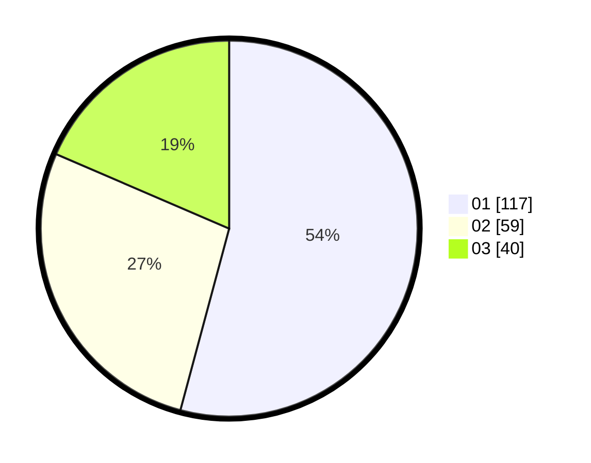

# Hasil

Hasil perolehan suara paslon dapat dilihat pada file paslon-01.txt, paslon-02.txt, dan paslon-03.txt.

Jika tidak ada, artinya data tersebut belum ada pada SIREKAP.

## Perolehan Suara

 * Paslon 01: **117**.
 * Paslon 02: **59**.
 * Paslon 03: **40**.

## Foto C Plano

https://sirekap-obj-formc.kpu.go.id/28b8/pemilu/ppwp/31/75/03/10/05/3175031005011-20240216-132654--bf88c71f-967e-4ea6-85db-351a677f9ead.jpg

https://sirekap-obj-formc.kpu.go.id/28b8/pemilu/ppwp/31/75/03/10/05/3175031005011-20240216-132655--06cd234d-78f7-4a28-80e9-e67da874d7cd.jpg

https://sirekap-obj-formc.kpu.go.id/28b8/pemilu/ppwp/31/75/03/10/05/3175031005011-20240216-132655--bbe103c5-db08-4fcc-9e0c-c2f9c033a7bb.jpg

## DATA PEMILIH TETAP

Jumlah pemilih dalam DPT: **280**.
 * L: **130**.
 * P: **150**.

## DATA PENGGUNA HAK PILIH

Jumlah pengguna hak pilih dalam DPT: **210**.
 * L: **96**.
 * P: **114**.

Jumlah pengguna hak pilih dalam DPTb: **2**.
 * L: **1**.
 * P: **1**.

Jumlah pengguna hak pilih dalam DPK: **5**.
 * L: **3**.
 * P: **2**.

Jumlah pengguna hak pilih: **217**.
 * L: **100**.
 * P: **117**.

## JUMLAH SUARA SAH DAN TIDAK SAH

JUMLAH SELURUH SUARA SAH: **216**.

JUMLAH SUARA TIDAK SAH: **1**.

JUMLAH SELURUH SUARA SAH DAN SUARA TIDAK SAH: **217**.
