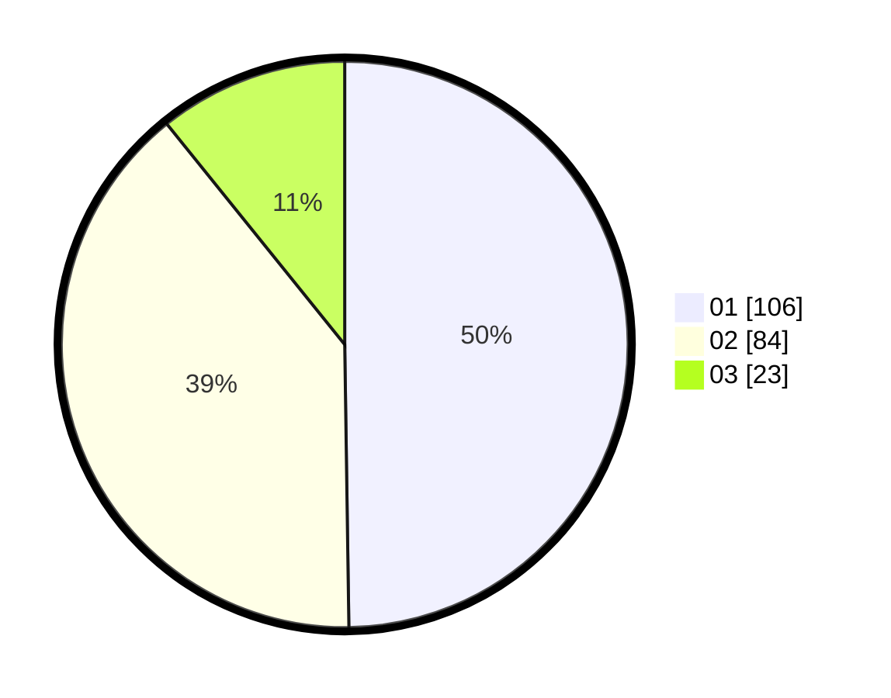

# Hasil

Hasil perolehan suara paslon dapat dilihat pada file paslon-01.txt, paslon-02.txt, dan paslon-03.txt.

Jika tidak ada, artinya data tersebut belum ada pada SIREKAP.

## Perolehan Suara

 * Paslon 01: **106**.
 * Paslon 02: **84**.
 * Paslon 03: **23**.

## Foto C Plano

https://sirekap-obj-formc.kpu.go.id/a9a4/pemilu/ppwp/31/75/03/10/05/3175031005014-20240214-213141--bedfff12-ead6-4a7c-ba1d-39a6668c3227.jpg

https://sirekap-obj-formc.kpu.go.id/a9a4/pemilu/ppwp/31/75/03/10/05/3175031005014-20240216-120901--0044bb60-1178-4517-a729-a867dfba6ccd.jpg

https://sirekap-obj-formc.kpu.go.id/a9a4/pemilu/ppwp/31/75/03/10/05/3175031005014-20240216-120855--c7c95af8-35d5-4bda-9cbd-531704ea96af.jpg

## DATA PEMILIH TETAP

Jumlah pemilih dalam DPT: **280**.
 * L: **131**.
 * P: **149**.

## DATA PENGGUNA HAK PILIH

Jumlah pengguna hak pilih dalam DPT: **213**.
 * L: **93**.
 * P: **120**.

Jumlah pengguna hak pilih dalam DPTb: **0**.
 * L: **0**.
 * P: **0**.

Jumlah pengguna hak pilih dalam DPK: **2**.
 * L: **0**.
 * P: **2**.

Jumlah pengguna hak pilih: **215**.
 * L: **93**.
 * P: **122**.

## JUMLAH SUARA SAH DAN TIDAK SAH

JUMLAH SELURUH SUARA SAH: **213**.

JUMLAH SUARA TIDAK SAH: **2**.

JUMLAH SELURUH SUARA SAH DAN SUARA TIDAK SAH: **215**.
