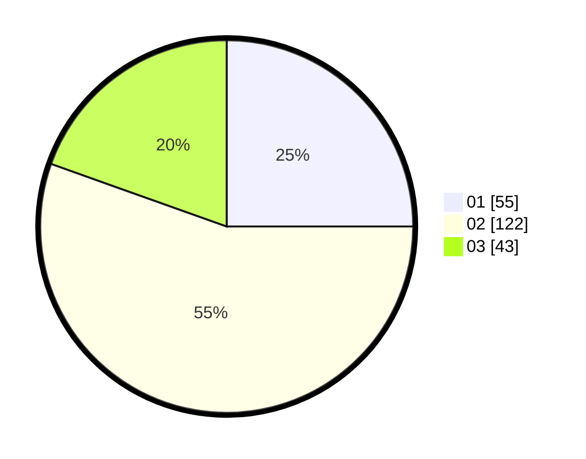

# Hasil

Hasil perolehan suara paslon dapat dilihat pada file paslon-01.txt, paslon-02.txt, dan paslon-03.txt.

Jika tidak ada, artinya data tersebut belum ada pada SIREKAP.

## Perolehan Suara

 * Paslon 01: **55**.
 * Paslon 02: **122**.
 * Paslon 03: **43**.

## Foto C Plano

https://sirekap-obj-formc.kpu.go.id/6ef9/pemilu/ppwp/31/75/03/10/05/3175031005015-20240214-191510--6284e846-6e21-4c45-9aa9-6e287c23b91c.jpg

https://sirekap-obj-formc.kpu.go.id/6ef9/pemilu/ppwp/31/75/03/10/05/3175031005015-20240214-190750--48160554-c848-4364-a5b4-7d9cace7c2ce.jpg

https://sirekap-obj-formc.kpu.go.id/6ef9/pemilu/ppwp/31/75/03/10/05/3175031005015-20240214-190904--ccc1a57e-8637-4069-9b4d-37a6c76d19af.jpg
