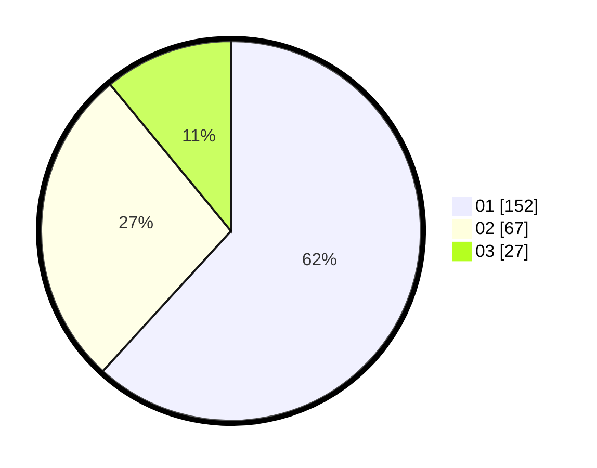

# Hasil

Hasil perolehan suara paslon dapat dilihat pada file paslon-01.txt, paslon-02.txt, dan paslon-03.txt.

Jika tidak ada, artinya data tersebut belum ada pada SIREKAP.

## Perolehan Suara

 * Paslon 01: **152**.
 * Paslon 02: **67**.
 * Paslon 03: **27**.

## Foto C Plano

https://sirekap-obj-formc.kpu.go.id/0223/pemilu/ppwp/31/75/03/10/05/3175031005018-20240216-071050--14a68b5e-a347-4ab7-9eeb-6bc547d30c45.jpg

https://sirekap-obj-formc.kpu.go.id/0223/pemilu/ppwp/31/75/03/10/05/3175031005018-20240216-071107--a50635f6-52de-4109-b05d-d3593a02dcf4.jpg

https://sirekap-obj-formc.kpu.go.id/0223/pemilu/ppwp/31/75/03/10/05/3175031005018-20240216-071058--db32f124-0e2e-4ced-a333-096d67987d42.jpg

## DATA PEMILIH TETAP

Jumlah pemilih dalam DPT: **281**.
 * L: **134**.
 * P: **147**.

## DATA PENGGUNA HAK PILIH

Jumlah pengguna hak pilih dalam DPT: **246**.
 * L: **117**.
 * P: **129**.

Jumlah pengguna hak pilih dalam DPTb: **0**.
 * L: **0**.
 * P: **0**.

Jumlah pengguna hak pilih dalam DPK: **1**.
 * L: **1**.
 * P: **0**.

Jumlah pengguna hak pilih: **247**.
 * L: **118**.
 * P: **129**.

## JUMLAH SUARA SAH DAN TIDAK SAH

JUMLAH SELURUH SUARA SAH: **246**.

JUMLAH SUARA TIDAK SAH: **1**.

JUMLAH SELURUH SUARA SAH DAN SUARA TIDAK SAH: **247**.
