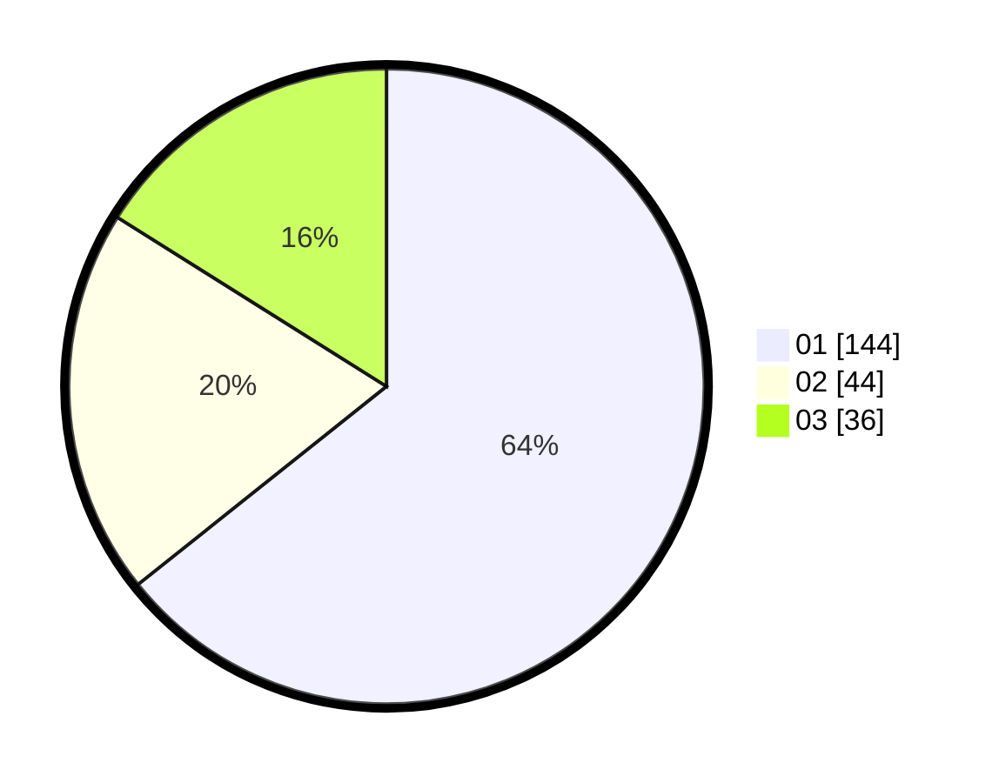

# Hasil

Hasil perolehan suara paslon dapat dilihat pada file paslon-01.txt, paslon-02.txt, dan paslon-03.txt.

Jika tidak ada, artinya data tersebut belum ada pada SIREKAP.

## Perolehan Suara

 * Paslon 01: **144**.
 * Paslon 02: **44**.
 * Paslon 03: **36**.

## Foto C Plano

https://sirekap-obj-formc.kpu.go.id/b7dd/pemilu/ppwp/31/75/03/10/05/3175031005019-20240214-191915--f4bf7951-fcff-4add-831a-60af840413e1.jpg

https://sirekap-obj-formc.kpu.go.id/b7dd/pemilu/ppwp/31/75/03/10/05/3175031005019-20240214-191057--d9b75d13-ddfc-4c1b-acad-ba477c81436f.jpg

https://sirekap-obj-formc.kpu.go.id/b7dd/pemilu/ppwp/31/75/03/10/05/3175031005019-20240214-191315--88337d50-34c5-4c14-a878-c8a71334c2d4.jpg

## DATA PEMILIH TETAP

Jumlah pemilih dalam DPT: **219**.
 * L: **101**.
 * P: **118**.

## DATA PENGGUNA HAK PILIH

Jumlah pengguna hak pilih dalam DPT: **219**.
 * L: **101**.
 * P: **118**.

Jumlah pengguna hak pilih dalam DPTb: **3**.
 * L: **3**.
 * P: **0**.

Jumlah pengguna hak pilih dalam DPK: **4**.
 * L: **2**.
 * P: **2**.

Jumlah pengguna hak pilih: **226**.
 * L: **106**.
 * P: **120**.

## JUMLAH SUARA SAH DAN TIDAK SAH

JUMLAH SELURUH SUARA SAH: **224**.

JUMLAH SUARA TIDAK SAH: **2**.

JUMLAH SELURUH SUARA SAH DAN SUARA TIDAK SAH: **226**.
