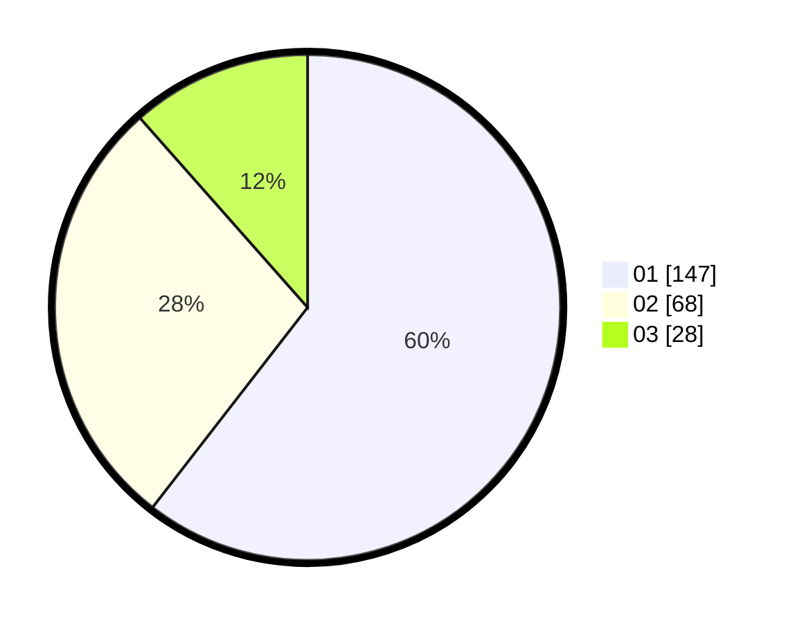

# Hasil

Hasil perolehan suara paslon dapat dilihat pada file paslon-01.txt, paslon-02.txt, dan paslon-03.txt.

Jika tidak ada, artinya data tersebut belum ada pada SIREKAP.

## Perolehan Suara

 * Paslon 01: **147**.
 * Paslon 02: **68**.
 * Paslon 03: **28**.

## Foto C Plano

https://sirekap-obj-formc.kpu.go.id/ab13/pemilu/ppwp/31/75/03/10/05/3175031005021-20240215-163130--a3160560-89f1-4322-9249-531cdd65d9a2.jpg

https://sirekap-obj-formc.kpu.go.id/ab13/pemilu/ppwp/31/75/03/10/05/3175031005021-20240215-163202--0e6e6f84-6d36-49eb-b43b-c47a8c3a22c0.jpg
