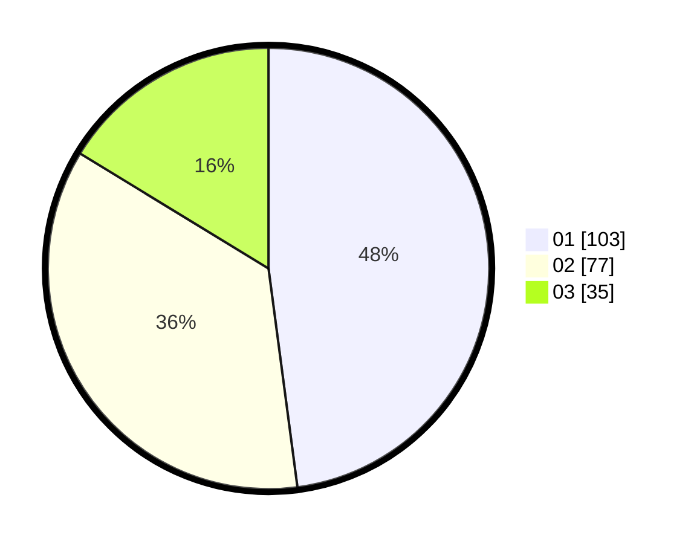

# Hasil

Hasil perolehan suara paslon dapat dilihat pada file paslon-01.txt, paslon-02.txt, dan paslon-03.txt.

Jika tidak ada, artinya data tersebut belum ada pada SIREKAP.

## Perolehan Suara

 * Paslon 01: **103**.
 * Paslon 02: **77**.
 * Paslon 03: **35**.

## Foto C Plano

https://sirekap-obj-formc.kpu.go.id/d1e8/pemilu/ppwp/31/75/03/10/05/3175031005022-20240216-092236--ad4233ad-a05b-42c5-8c56-1a669e69f144.jpg

https://sirekap-obj-formc.kpu.go.id/d1e8/pemilu/ppwp/31/75/03/10/05/3175031005022-20240216-094751--fb215768-afb7-4873-bc32-e2cbaebb3b34.jpg

https://sirekap-obj-formc.kpu.go.id/d1e8/pemilu/ppwp/31/75/03/10/05/3175031005022-20240214-210711--3c20446e-fcd4-4b7a-81a4-fe61c8b7c0ba.jpg

## DATA PEMILIH TETAP

Jumlah pemilih dalam DPT: **285**.
 * L: **148**.
 * P: **137**.

## DATA PENGGUNA HAK PILIH

Jumlah pengguna hak pilih dalam DPT: **220**.
 * L: **108**.
 * P: **112**.

Jumlah pengguna hak pilih dalam DPTb: **0**.
 * L: **0**.
 * P: **0**.

Jumlah pengguna hak pilih dalam DPK: **0**.
 * L: **0**.
 * P: **0**.

Jumlah pengguna hak pilih: **220**.
 * L: **108**.
 * P: **112**.

## JUMLAH SUARA SAH DAN TIDAK SAH

JUMLAH SELURUH SUARA SAH: **215**.

JUMLAH SUARA TIDAK SAH: **5**.

JUMLAH SELURUH SUARA SAH DAN SUARA TIDAK SAH: **220**.
