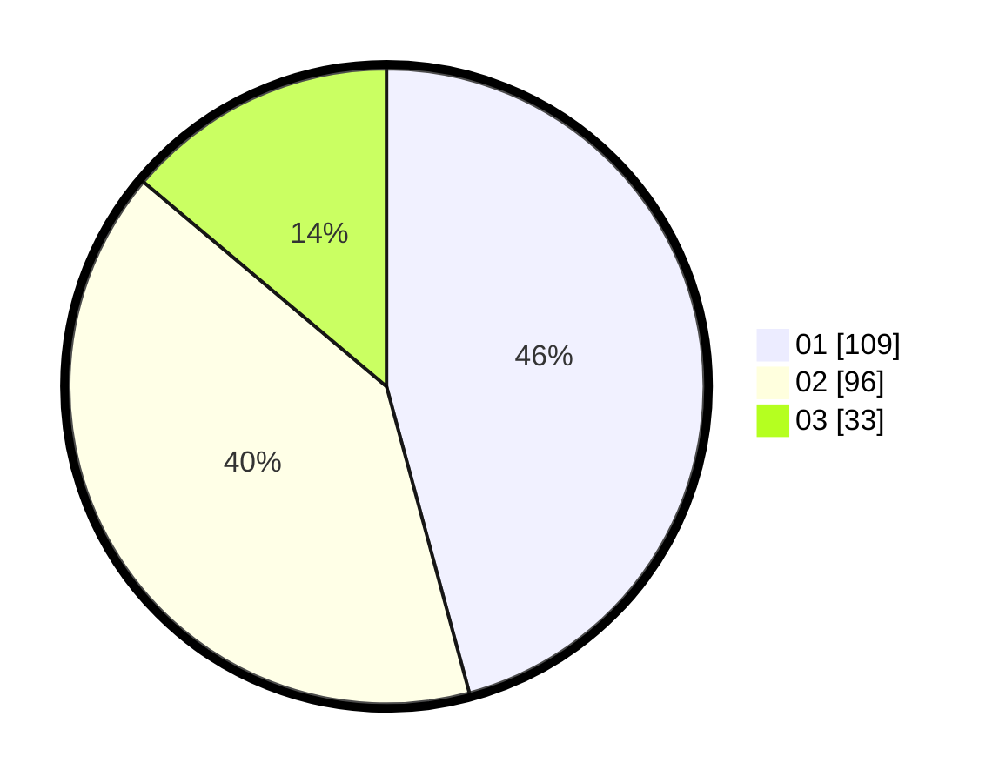

# Hasil

Hasil perolehan suara paslon dapat dilihat pada file paslon-01.txt, paslon-02.txt, dan paslon-03.txt.

Jika tidak ada, artinya data tersebut belum ada pada SIREKAP.

## Perolehan Suara

 * Paslon 01: **109**.
 * Paslon 02: **96**.
 * Paslon 03: **33**.

## Foto C Plano

https://sirekap-obj-formc.kpu.go.id/3e38/pemilu/ppwp/31/75/03/10/05/3175031005025-20240215-050815--062a0c4c-2bdf-4ce8-a4bb-271dd798b510.jpg

https://sirekap-obj-formc.kpu.go.id/3e38/pemilu/ppwp/31/75/03/10/05/3175031005025-20240215-050836--9fc2dcb2-a35d-4144-acfd-2db3e2ee555c.jpg

https://sirekap-obj-formc.kpu.go.id/3e38/pemilu/ppwp/31/75/03/10/05/3175031005025-20240215-050825--e4aec5fb-a469-4f8a-b1a0-5efc1a5b4148.jpg

## DATA PEMILIH TETAP

Jumlah pemilih dalam DPT: **290**.
 * L: **150**.
 * P: **140**.

## DATA PENGGUNA HAK PILIH

Jumlah pengguna hak pilih dalam DPT: **224**.
 * L: **113**.
 * P: **111**.

Jumlah pengguna hak pilih dalam DPTb: **16**.
 * L: **6**.
 * P: **10**.

Jumlah pengguna hak pilih dalam DPK: **0**.
 * L: **0**.
 * P: **0**.

Jumlah pengguna hak pilih: **240**.
 * L: **119**.
 * P: **121**.

## JUMLAH SUARA SAH DAN TIDAK SAH

JUMLAH SELURUH SUARA SAH: **238**.

JUMLAH SUARA TIDAK SAH: **2**.

JUMLAH SELURUH SUARA SAH DAN SUARA TIDAK SAH: **240**.
