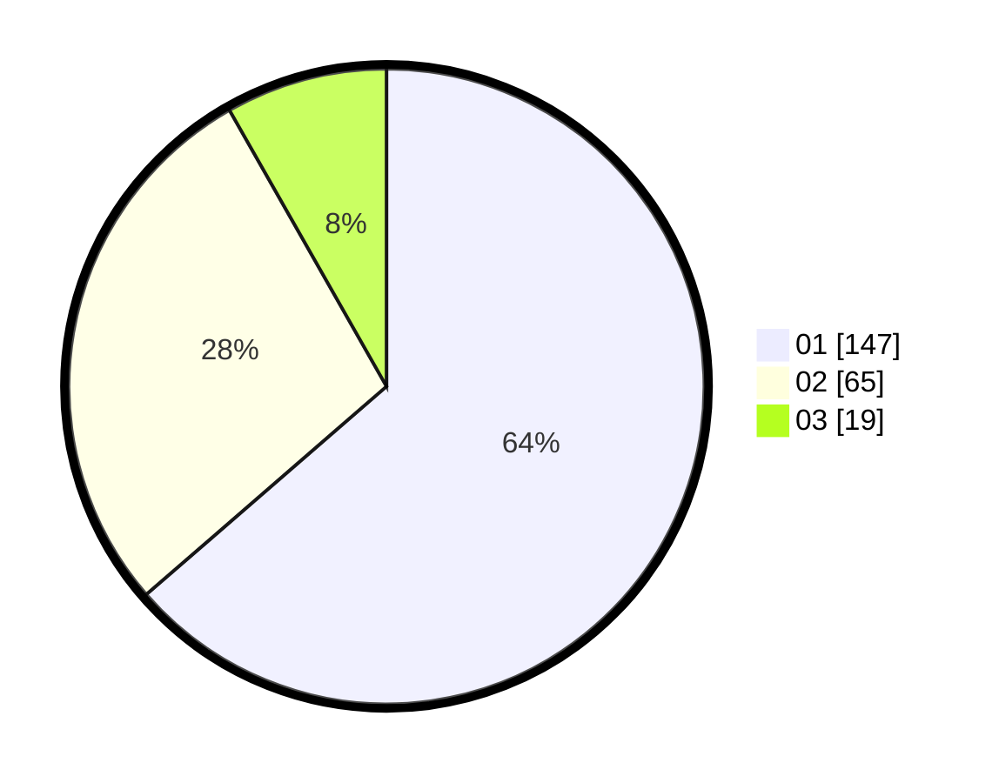

# Hasil

Hasil perolehan suara paslon dapat dilihat pada file paslon-01.txt, paslon-02.txt, dan paslon-03.txt.

Jika tidak ada, artinya data tersebut belum ada pada SIREKAP.

## Perolehan Suara

 * Paslon 01: **147**.
 * Paslon 02: **65**.
 * Paslon 03: **19**.

## Foto C Plano

https://sirekap-obj-formc.kpu.go.id/7fc7/pemilu/ppwp/31/75/03/10/05/3175031005032-20240214-155033--972dd95f-e585-425f-a7c6-4f4349855d7a.jpg

https://sirekap-obj-formc.kpu.go.id/7fc7/pemilu/ppwp/31/75/03/10/05/3175031005032-20240214-211705--aecf5d58-c8da-42c6-9dbb-a0d0ea587e1f.jpg

https://sirekap-obj-formc.kpu.go.id/7fc7/pemilu/ppwp/31/75/03/10/05/3175031005032-20240214-220532--b8642b24-ea57-4531-84a0-7b5220aeda71.jpg

## DATA PEMILIH TETAP

Jumlah pemilih dalam DPT: **279**.
 * L: **139**.
 * P: **140**.

## DATA PENGGUNA HAK PILIH

Jumlah pengguna hak pilih dalam DPT: **231**.
 * L: **110**.
 * P: **121**.

Jumlah pengguna hak pilih dalam DPTb: **3**.
 * L: **1**.
 * P: **2**.

Jumlah pengguna hak pilih dalam DPK: **0**.
 * L: **0**.
 * P: **0**.

Jumlah pengguna hak pilih: **234**.
 * L: **111**.
 * P: **123**.

## JUMLAH SUARA SAH DAN TIDAK SAH

JUMLAH SELURUH SUARA SAH: **231**.

JUMLAH SUARA TIDAK SAH: **3**.

JUMLAH SELURUH SUARA SAH DAN SUARA TIDAK SAH: **234**.
