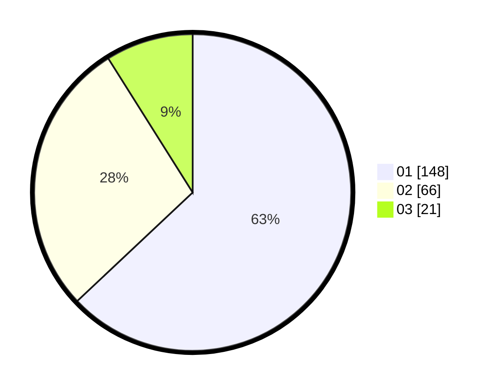

# Hasil

Hasil perolehan suara paslon dapat dilihat pada file paslon-01.txt, paslon-02.txt, dan paslon-03.txt.

Jika tidak ada, artinya data tersebut belum ada pada SIREKAP.

## Perolehan Suara

 * Paslon 01: **148**.
 * Paslon 02: **66**.
 * Paslon 03: **21**.

## Foto C Plano

https://sirekap-obj-formc.kpu.go.id/4115/pemilu/ppwp/31/75/03/10/05/3175031005037-20240216-151201--73761362-5747-4522-ad52-144045af7613.jpg

https://sirekap-obj-formc.kpu.go.id/4115/pemilu/ppwp/31/75/03/10/05/3175031005037-20240216-151203--01cfe2cf-a58d-4264-9988-be9954291e03.jpg

https://sirekap-obj-formc.kpu.go.id/4115/pemilu/ppwp/31/75/03/10/05/3175031005037-20240216-151202--e9901418-2ac0-4134-aff4-3d00bb00fcc5.jpg

## DATA PEMILIH TETAP

Jumlah pemilih dalam DPT: **279**.
 * L: **138**.
 * P: **141**.

## DATA PENGGUNA HAK PILIH

Jumlah pengguna hak pilih dalam DPT: **231**.
 * L: **110**.
 * P: **121**.

Jumlah pengguna hak pilih dalam DPTb: **3**.
 * L: **2**.
 * P: **1**.

Jumlah pengguna hak pilih dalam DPK: **2**.
 * L: **2**.
 * P: **0**.

Jumlah pengguna hak pilih: **236**.
 * L: **114**.
 * P: **122**.

## JUMLAH SUARA SAH DAN TIDAK SAH

JUMLAH SELURUH SUARA SAH: **235**.

JUMLAH SUARA TIDAK SAH: **1**.

JUMLAH SELURUH SUARA SAH DAN SUARA TIDAK SAH: **236**.
