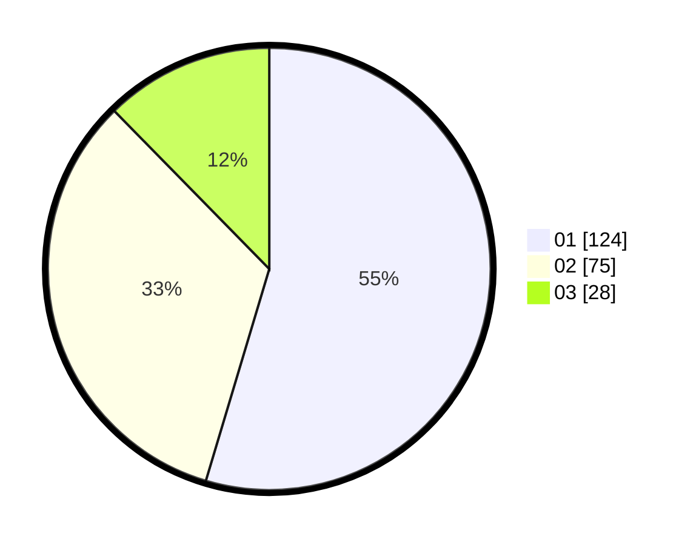

# Hasil

Hasil perolehan suara paslon dapat dilihat pada file paslon-01.txt, paslon-02.txt, dan paslon-03.txt.

Jika tidak ada, artinya data tersebut belum ada pada SIREKAP.

## Perolehan Suara

 * Paslon 01: **124**.
 * Paslon 02: **75**.
 * Paslon 03: **28**.

## Foto C Plano

https://sirekap-obj-formc.kpu.go.id/6b3b/pemilu/ppwp/31/75/03/10/05/3175031005039-20240214-175446--105d9a37-d288-419b-a452-ce80bf8c2dab.jpg

https://sirekap-obj-formc.kpu.go.id/6b3b/pemilu/ppwp/31/75/03/10/05/3175031005039-20240216-072827--941a1df9-5fc6-487b-9369-e9cec74aa684.jpg

https://sirekap-obj-formc.kpu.go.id/6b3b/pemilu/ppwp/31/75/03/10/05/3175031005039-20240214-185435--87071d24-cf3e-4b6d-b58b-10322ece68b4.jpg

## DATA PEMILIH TETAP

Jumlah pemilih dalam DPT: **277**.
 * L: **129**.
 * P: **148**.

## DATA PENGGUNA HAK PILIH

Jumlah pengguna hak pilih dalam DPT: **230**.
 * L: **105**.
 * P: **125**.

Jumlah pengguna hak pilih dalam DPTb: **0**.
 * L: **0**.
 * P: **0**.

Jumlah pengguna hak pilih dalam DPK: **0**.
 * L: **0**.
 * P: **0**.

Jumlah pengguna hak pilih: **230**.
 * L: **105**.
 * P: **125**.

## JUMLAH SUARA SAH DAN TIDAK SAH

JUMLAH SELURUH SUARA SAH: **227**.

JUMLAH SUARA TIDAK SAH: **3**.

JUMLAH SELURUH SUARA SAH DAN SUARA TIDAK SAH: **230**.
