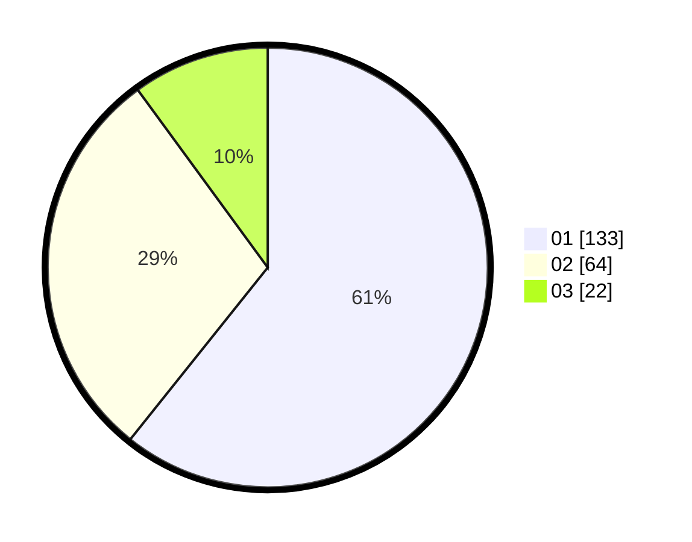

# Hasil

Hasil perolehan suara paslon dapat dilihat pada file paslon-01.txt, paslon-02.txt, dan paslon-03.txt.

Jika tidak ada, artinya data tersebut belum ada pada SIREKAP.

## Perolehan Suara

 * Paslon 01: **133**.
 * Paslon 02: **64**.
 * Paslon 03: **22**.

## Foto C Plano

https://sirekap-obj-formc.kpu.go.id/9f06/pemilu/ppwp/31/75/03/10/05/3175031005041-20240216-122448--e1978414-b13c-49a2-b44f-4373b0850c98.jpg

https://sirekap-obj-formc.kpu.go.id/9f06/pemilu/ppwp/31/75/03/10/05/3175031005041-20240216-122450--3b8d2405-60f6-47c4-afc7-5e1b7d25d1e3.jpg

https://sirekap-obj-formc.kpu.go.id/9f06/pemilu/ppwp/31/75/03/10/05/3175031005041-20240216-122449--41d531e3-a154-40b2-99a8-19e6d807c699.jpg

## DATA PEMILIH TETAP

Jumlah pemilih dalam DPT: **276**.
 * L: **136**.
 * P: **140**.

## DATA PENGGUNA HAK PILIH

Jumlah pengguna hak pilih dalam DPT: **213**.
 * L: **102**.
 * P: **111**.

Jumlah pengguna hak pilih dalam DPTb: **6**.
 * L: **6**.
 * P: **0**.

Jumlah pengguna hak pilih dalam DPK: **2**.
 * L: **0**.
 * P: **2**.

Jumlah pengguna hak pilih: **221**.
 * L: **108**.
 * P: **113**.

## JUMLAH SUARA SAH DAN TIDAK SAH

JUMLAH SELURUH SUARA SAH: **219**.

JUMLAH SUARA TIDAK SAH: **2**.

JUMLAH SELURUH SUARA SAH DAN SUARA TIDAK SAH: **221**.
