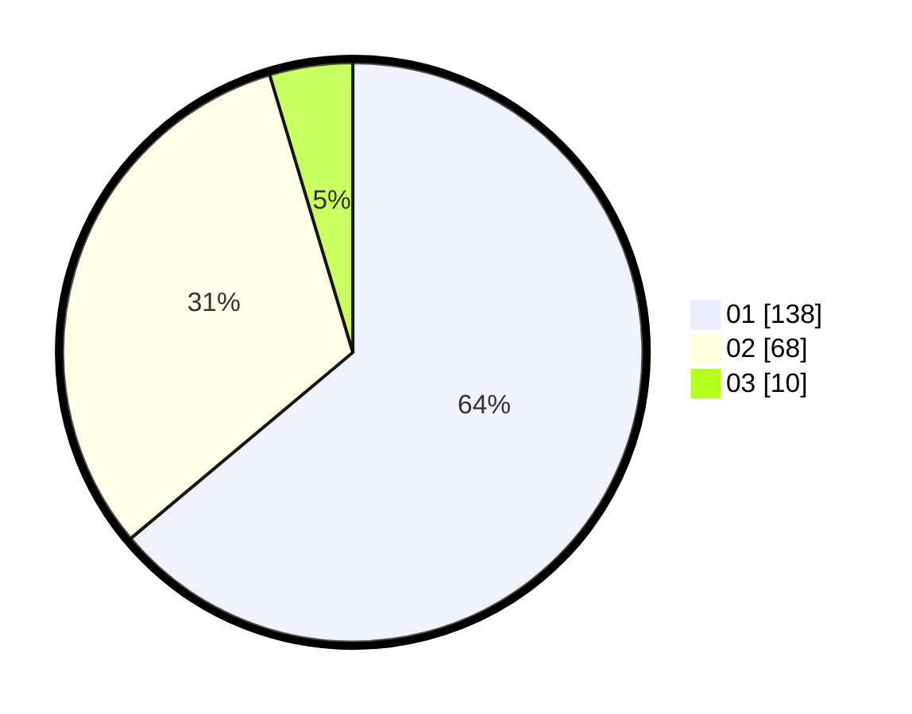

# Hasil

Hasil perolehan suara paslon dapat dilihat pada file paslon-01.txt, paslon-02.txt, dan paslon-03.txt.

Jika tidak ada, artinya data tersebut belum ada pada SIREKAP.

## Perolehan Suara

 * Paslon 01: **138**.
 * Paslon 02: **68**.
 * Paslon 03: **10**.

## Foto C Plano

https://sirekap-obj-formc.kpu.go.id/6d74/pemilu/ppwp/31/75/03/10/05/3175031005042-20240216-152926--93242499-87a8-45a2-945a-eed6639b8958.jpg

https://sirekap-obj-formc.kpu.go.id/6d74/pemilu/ppwp/31/75/03/10/05/3175031005042-20240215-021744--cd45320d-7121-48cd-9b85-a5636d5ccfe1.jpg

https://sirekap-obj-formc.kpu.go.id/6d74/pemilu/ppwp/31/75/03/10/05/3175031005042-20240215-153828--59115849-5c21-4c4a-b7d3-6a396527990e.jpg

## DATA PEMILIH TETAP

Jumlah pemilih dalam DPT: **273**.
 * L: **133**.
 * P: **140**.

## DATA PENGGUNA HAK PILIH

Jumlah pengguna hak pilih dalam DPT: **210**.
 * L: **105**.
 * P: **105**.

Jumlah pengguna hak pilih dalam DPTb: **4**.
 * L: **0**.
 * P: **4**.

Jumlah pengguna hak pilih dalam DPK: **7**.
 * L: **4**.
 * P: **3**.

Jumlah pengguna hak pilih: **221**.
 * L: **109**.
 * P: **112**.

## JUMLAH SUARA SAH DAN TIDAK SAH

JUMLAH SELURUH SUARA SAH: **216**.

JUMLAH SUARA TIDAK SAH: **5**.

JUMLAH SELURUH SUARA SAH DAN SUARA TIDAK SAH: **221**.
