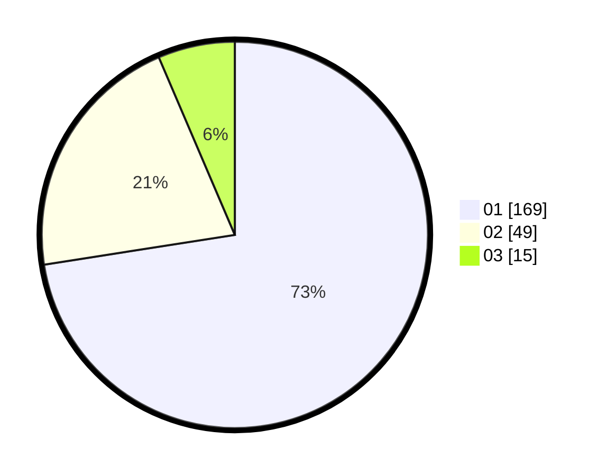

# Hasil

Hasil perolehan suara paslon dapat dilihat pada file paslon-01.txt, paslon-02.txt, dan paslon-03.txt.

Jika tidak ada, artinya data tersebut belum ada pada SIREKAP.

## Perolehan Suara

 * Paslon 01: **169**.
 * Paslon 02: **49**.
 * Paslon 03: **15**.

## Foto C Plano

https://sirekap-obj-formc.kpu.go.id/70c3/pemilu/ppwp/31/75/03/10/05/3175031005044-20240216-180127--91087e20-8886-4ee6-a0ed-76ef2b684354.jpg

https://sirekap-obj-formc.kpu.go.id/70c3/pemilu/ppwp/31/75/03/10/05/3175031005044-20240216-180128--8a1b0ba2-a3b0-42d6-8936-d32fc47db68c.jpg

https://sirekap-obj-formc.kpu.go.id/70c3/pemilu/ppwp/31/75/03/10/05/3175031005044-20240214-223217--021a076e-51fe-4290-8438-4cc67713e203.jpg

## DATA PEMILIH TETAP

Jumlah pemilih dalam DPT: **269**.
 * L: **125**.
 * P: **144**.

## DATA PENGGUNA HAK PILIH

Jumlah pengguna hak pilih dalam DPT: **211**.
 * L: **96**.
 * P: **115**.

Jumlah pengguna hak pilih dalam DPTb: **19**.
 * L: **12**.
 * P: **7**.

Jumlah pengguna hak pilih dalam DPK: **6**.
 * L: **2**.
 * P: **4**.

Jumlah pengguna hak pilih: **236**.
 * L: **110**.
 * P: **126**.

## JUMLAH SUARA SAH DAN TIDAK SAH

JUMLAH SELURUH SUARA SAH: **233**.

JUMLAH SUARA TIDAK SAH: **3**.

JUMLAH SELURUH SUARA SAH DAN SUARA TIDAK SAH: **236**.
