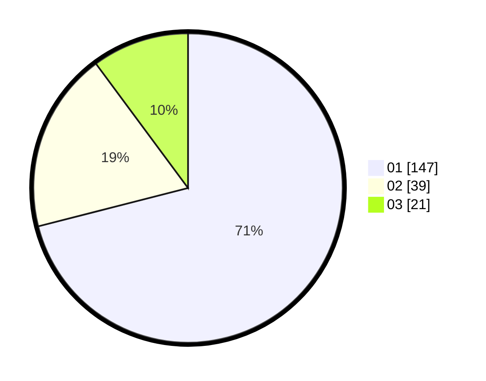

# Hasil

Hasil perolehan suara paslon dapat dilihat pada file paslon-01.txt, paslon-02.txt, dan paslon-03.txt.

Jika tidak ada, artinya data tersebut belum ada pada SIREKAP.

## Perolehan Suara

 * Paslon 01: **147**.
 * Paslon 02: **39**.
 * Paslon 03: **21**.

## Foto C Plano

https://sirekap-obj-formc.kpu.go.id/b8ab/pemilu/ppwp/31/75/03/10/05/3175031005045-20240216-093449--6e09485e-3aa1-439a-851e-8cb01d1748e5.jpg

https://sirekap-obj-formc.kpu.go.id/b8ab/pemilu/ppwp/31/75/03/10/05/3175031005045-20240216-093451--70a85098-cf5c-4fb2-a5de-f2ec7b71dfb0.jpg

https://sirekap-obj-formc.kpu.go.id/b8ab/pemilu/ppwp/31/75/03/10/05/3175031005045-20240216-093450--5053a3d0-53e5-4509-9a74-1df3bb21e69d.jpg

## DATA PEMILIH TETAP

Jumlah pemilih dalam DPT: **269**.
 * L: **134**.
 * P: **135**.

## DATA PENGGUNA HAK PILIH

Jumlah pengguna hak pilih dalam DPT: **210**.
 * L: **104**.
 * P: **106**.

Jumlah pengguna hak pilih dalam DPTb: **1**.
 * L: **1**.
 * P: **0**.

Jumlah pengguna hak pilih dalam DPK: **2**.
 * L: **1**.
 * P: **1**.

Jumlah pengguna hak pilih: **213**.
 * L: **106**.
 * P: **107**.

## JUMLAH SUARA SAH DAN TIDAK SAH

JUMLAH SELURUH SUARA SAH: **207**.

JUMLAH SUARA TIDAK SAH: **6**.

JUMLAH SELURUH SUARA SAH DAN SUARA TIDAK SAH: **213**.
