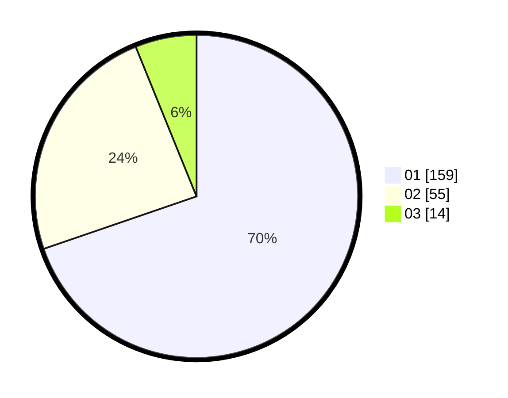

# Hasil

Hasil perolehan suara paslon dapat dilihat pada file paslon-01.txt, paslon-02.txt, dan paslon-03.txt.

Jika tidak ada, artinya data tersebut belum ada pada SIREKAP.

## Perolehan Suara

 * Paslon 01: **159**.
 * Paslon 02: **55**.
 * Paslon 03: **14**.

## Foto C Plano

https://sirekap-obj-formc.kpu.go.id/dfe9/pemilu/ppwp/31/75/03/10/05/3175031005047-20240216-144104--058f87bd-9bf4-4c83-8750-b1830de9b078.jpg

https://sirekap-obj-formc.kpu.go.id/dfe9/pemilu/ppwp/31/75/03/10/05/3175031005047-20240216-144105--8b11f0d0-1816-4830-99fb-fa86b994455e.jpg

https://sirekap-obj-formc.kpu.go.id/dfe9/pemilu/ppwp/31/75/03/10/05/3175031005047-20240214-160112--2da2e2f9-21a5-4ebb-a7b5-ea03c965c2fc.jpg

## DATA PEMILIH TETAP

Jumlah pemilih dalam DPT: **274**.
 * L: **143**.
 * P: **131**.

## DATA PENGGUNA HAK PILIH

Jumlah pengguna hak pilih dalam DPT: **226**.
 * L: **110**.
 * P: **116**.

Jumlah pengguna hak pilih dalam DPTb: **2**.
 * L: **1**.
 * P: **1**.

Jumlah pengguna hak pilih dalam DPK: **3**.
 * L: **1**.
 * P: **2**.

Jumlah pengguna hak pilih: **231**.
 * L: **112**.
 * P: **119**.

## JUMLAH SUARA SAH DAN TIDAK SAH

JUMLAH SELURUH SUARA SAH: **228**.

JUMLAH SUARA TIDAK SAH: **3**.

JUMLAH SELURUH SUARA SAH DAN SUARA TIDAK SAH: **231**.
