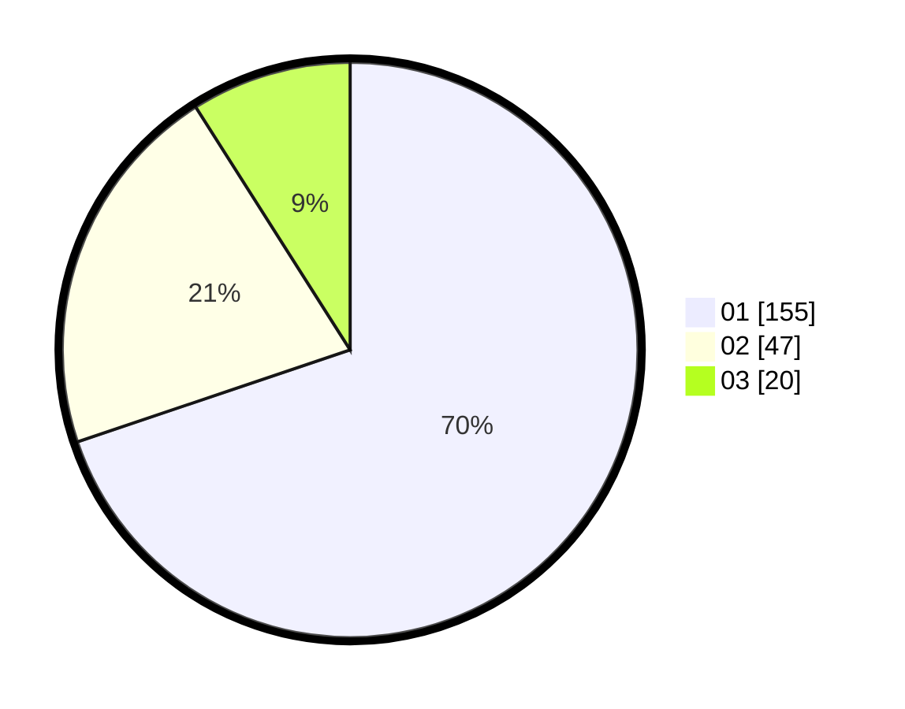

# Hasil

Hasil perolehan suara paslon dapat dilihat pada file paslon-01.txt, paslon-02.txt, dan paslon-03.txt.

Jika tidak ada, artinya data tersebut belum ada pada SIREKAP.

## Perolehan Suara

 * Paslon 01: **155**.
 * Paslon 02: **47**.
 * Paslon 03: **20**.

## Foto C Plano

https://sirekap-obj-formc.kpu.go.id/4728/pemilu/ppwp/31/75/03/10/05/3175031005048-20240216-121334--3af26e10-493e-4482-a660-7cdb7d3aaf8e.jpg

https://sirekap-obj-formc.kpu.go.id/4728/pemilu/ppwp/31/75/03/10/05/3175031005048-20240216-121336--fbfd67e0-f51f-4401-aefe-e32c5e95bbe6.jpg

https://sirekap-obj-formc.kpu.go.id/4728/pemilu/ppwp/31/75/03/10/05/3175031005048-20240216-121335--ce5767b0-3941-46c4-84b5-cd6a1e977006.jpg

## DATA PEMILIH TETAP

Jumlah pemilih dalam DPT: **274**.
 * L: **141**.
 * P: **133**.

## DATA PENGGUNA HAK PILIH

Jumlah pengguna hak pilih dalam DPT: **220**.
 * L: **112**.
 * P: **108**.

Jumlah pengguna hak pilih dalam DPTb: **2**.
 * L: **2**.
 * P: **0**.

Jumlah pengguna hak pilih dalam DPK: **1**.
 * L: **1**.
 * P: **0**.

Jumlah pengguna hak pilih: **223**.
 * L: **115**.
 * P: **108**.

## JUMLAH SUARA SAH DAN TIDAK SAH

JUMLAH SELURUH SUARA SAH: **222**.

JUMLAH SUARA TIDAK SAH: **1**.

JUMLAH SELURUH SUARA SAH DAN SUARA TIDAK SAH: **223**.
