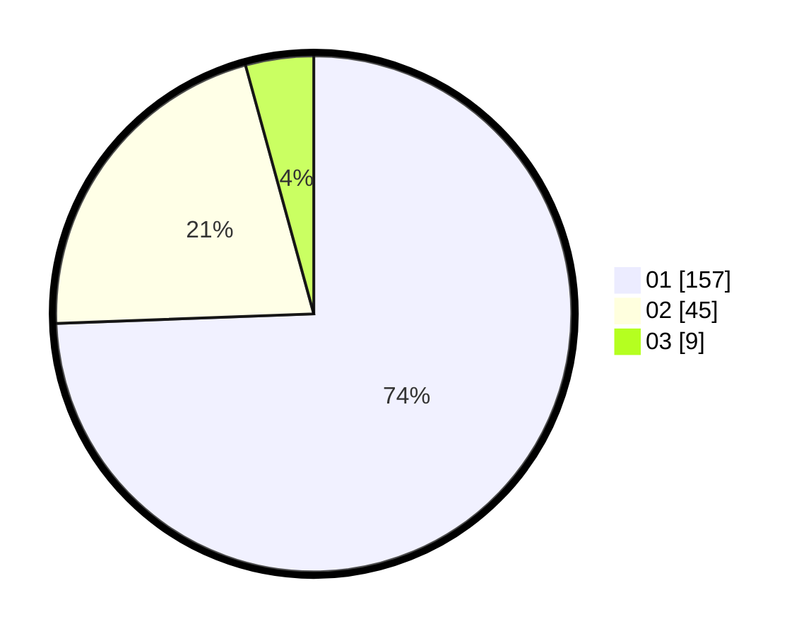

# Hasil

Hasil perolehan suara paslon dapat dilihat pada file paslon-01.txt, paslon-02.txt, dan paslon-03.txt.

Jika tidak ada, artinya data tersebut belum ada pada SIREKAP.

## Perolehan Suara

 * Paslon 01: **157**.
 * Paslon 02: **45**.
 * Paslon 03: **9**.

## Foto C Plano

https://sirekap-obj-formc.kpu.go.id/a8f3/pemilu/ppwp/31/75/03/10/05/3175031005053-20240214-184555--23c94e47-c263-4cfe-bba7-e92613cbd4f6.jpg

https://sirekap-obj-formc.kpu.go.id/a8f3/pemilu/ppwp/31/75/03/10/05/3175031005053-20240214-193709--a3cb091d-1f1e-4eee-ba5a-0ce329248250.jpg

https://sirekap-obj-formc.kpu.go.id/a8f3/pemilu/ppwp/31/75/03/10/05/3175031005053-20240214-185945--8221f4e8-1d42-46b1-b86e-dfa813025af6.jpg

## DATA PEMILIH TETAP

Jumlah pemilih dalam DPT: **267**.
 * L: **123**.
 * P: **144**.

## DATA PENGGUNA HAK PILIH

Jumlah pengguna hak pilih dalam DPT: **220**.
 * L: **99**.
 * P: **121**.

Jumlah pengguna hak pilih dalam DPTb: **2**.
 * L: **0**.
 * P: **2**.

Jumlah pengguna hak pilih dalam DPK: **1**.
 * L: **0**.
 * P: **1**.

Jumlah pengguna hak pilih: **223**.
 * L: **99**.
 * P: **124**.

## JUMLAH SUARA SAH DAN TIDAK SAH

JUMLAH SELURUH SUARA SAH: **222**.

JUMLAH SUARA TIDAK SAH: **1**.

JUMLAH SELURUH SUARA SAH DAN SUARA TIDAK SAH: **223**.
