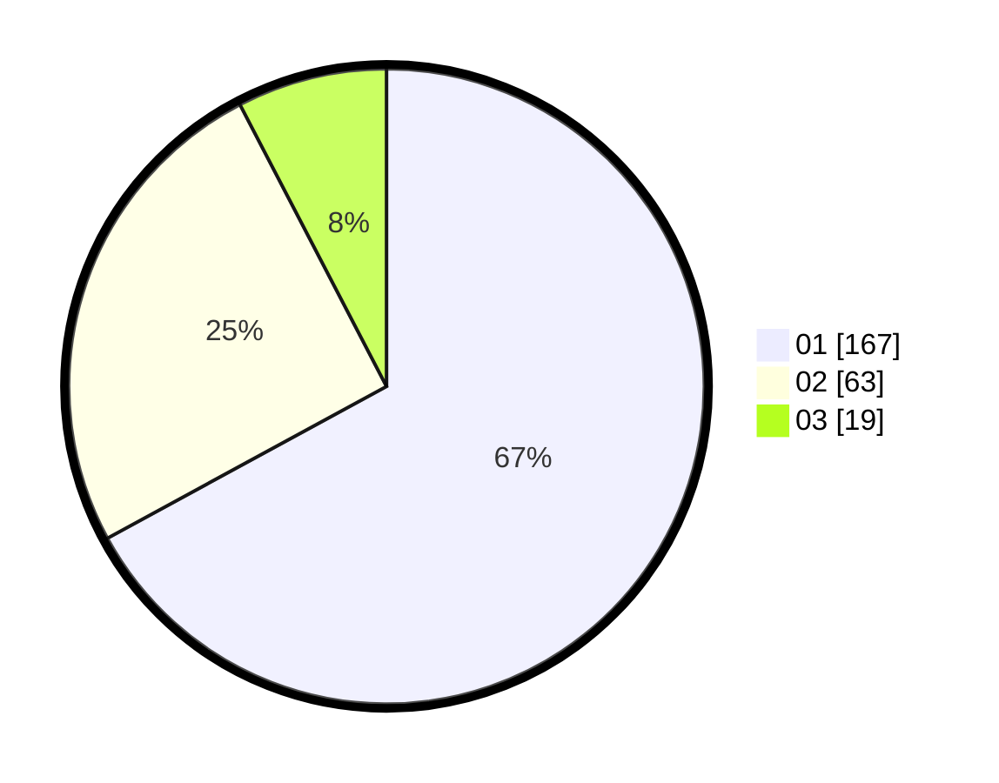

# Hasil

Hasil perolehan suara paslon dapat dilihat pada file paslon-01.txt, paslon-02.txt, dan paslon-03.txt.

Jika tidak ada, artinya data tersebut belum ada pada SIREKAP.

## Perolehan Suara

 * Paslon 01: **167**.
 * Paslon 02: **63**.
 * Paslon 03: **19**.

## Foto C Plano

https://sirekap-obj-formc.kpu.go.id/e9c7/pemilu/ppwp/31/75/03/10/05/3175031005054-20240216-132217--13ab3f8e-f98d-4ecf-97f7-67ec92cbc937.jpg

https://sirekap-obj-formc.kpu.go.id/e9c7/pemilu/ppwp/31/75/03/10/05/3175031005054-20240216-132218--243c6f5e-5015-4956-809a-ddfecd64b028.jpg

https://sirekap-obj-formc.kpu.go.id/e9c7/pemilu/ppwp/31/75/03/10/05/3175031005054-20240216-132217--67a0e31d-c063-41ad-930e-399b278a9185.jpg

## DATA PEMILIH TETAP

Jumlah pemilih dalam DPT: **290**.
 * L: **139**.
 * P: **151**.

## DATA PENGGUNA HAK PILIH

Jumlah pengguna hak pilih dalam DPT: **134**.
 * L: **104**.
 * P: **130**.

Jumlah pengguna hak pilih dalam DPTb: **10**.
 * L: **4**.
 * P: **6**.

Jumlah pengguna hak pilih dalam DPK: **5**.
 * L: **3**.
 * P: **2**.

Jumlah pengguna hak pilih: **249**.
 * L: **111**.
 * P: **138**.

## JUMLAH SUARA SAH DAN TIDAK SAH

JUMLAH SELURUH SUARA SAH: **249**.

JUMLAH SUARA TIDAK SAH: **0**.

JUMLAH SELURUH SUARA SAH DAN SUARA TIDAK SAH: **249**.
