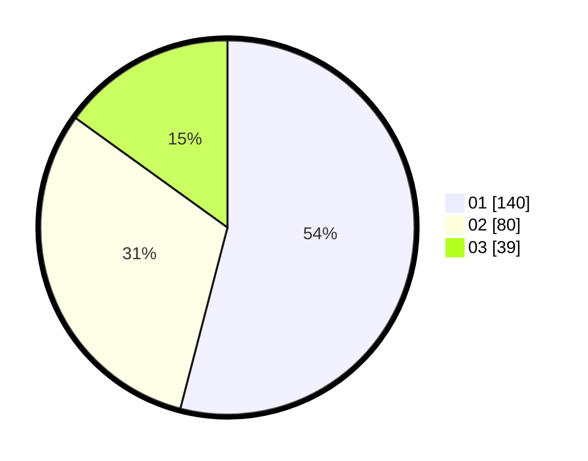

# Hasil

Hasil perolehan suara paslon dapat dilihat pada file paslon-01.txt, paslon-02.txt, dan paslon-03.txt.

Jika tidak ada, artinya data tersebut belum ada pada SIREKAP.

## Perolehan Suara

 * Paslon 01: **140**.
 * Paslon 02: **80**.
 * Paslon 03: **39**.

## Foto C Plano

https://sirekap-obj-formc.kpu.go.id/becc/pemilu/ppwp/31/75/03/10/05/3175031005055-20240216-005404--4025603b-3b48-47f5-940d-b8d2f53e83e7.jpg

https://sirekap-obj-formc.kpu.go.id/becc/pemilu/ppwp/31/75/03/10/05/3175031005055-20240216-005409--a7e2af13-a8d7-4541-9bf9-1c3dafa0af20.jpg

https://sirekap-obj-formc.kpu.go.id/becc/pemilu/ppwp/31/75/03/10/05/3175031005055-20240216-005406--eba289b6-698c-4685-a6f2-e7261f2dc265.jpg

## DATA PEMILIH TETAP

Jumlah pemilih dalam DPT: **295**.
 * L: **146**.
 * P: **149**.

## DATA PENGGUNA HAK PILIH

Jumlah pengguna hak pilih dalam DPT: **249**.
 * L: **119**.
 * P: **130**.

Jumlah pengguna hak pilih dalam DPTb: **9**.
 * L: **4**.
 * P: **5**.

Jumlah pengguna hak pilih dalam DPK: **4**.
 * L: **2**.
 * P: **2**.

Jumlah pengguna hak pilih: **262**.
 * L: **125**.
 * P: **137**.

## JUMLAH SUARA SAH DAN TIDAK SAH

JUMLAH SELURUH SUARA SAH: **259**.

JUMLAH SUARA TIDAK SAH: **3**.

JUMLAH SELURUH SUARA SAH DAN SUARA TIDAK SAH: **262**.
