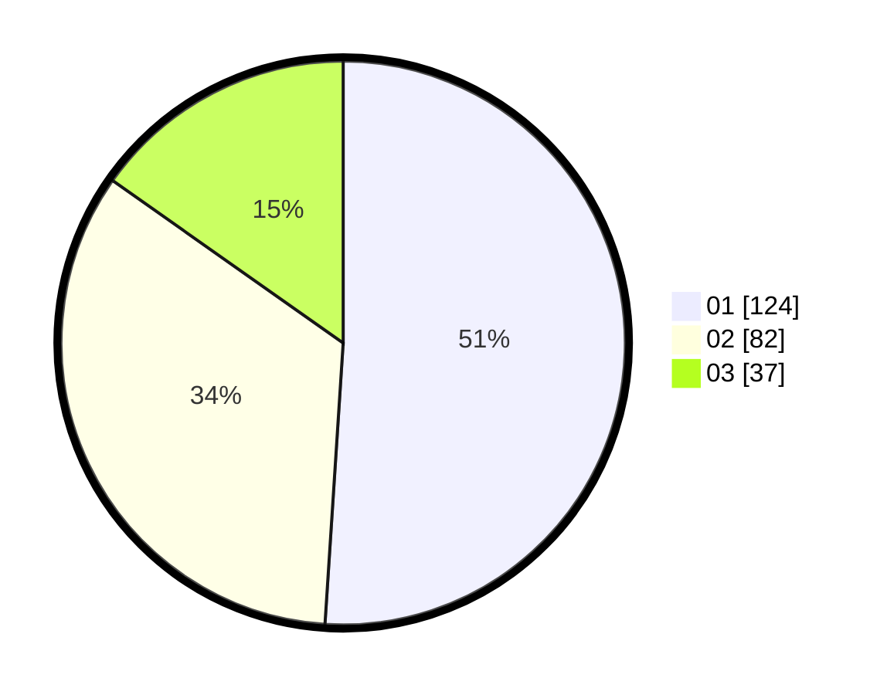

# Hasil

Hasil perolehan suara paslon dapat dilihat pada file paslon-01.txt, paslon-02.txt, dan paslon-03.txt.

Jika tidak ada, artinya data tersebut belum ada pada SIREKAP.

## Perolehan Suara

 * Paslon 01: **124**.
 * Paslon 02: **82**.
 * Paslon 03: **37**.

## Foto C Plano

https://sirekap-obj-formc.kpu.go.id/fd22/pemilu/ppwp/31/75/03/10/05/3175031005057-20240216-061836--66d84aa0-41b8-410b-a97d-387809f74f15.jpg

https://sirekap-obj-formc.kpu.go.id/fd22/pemilu/ppwp/31/75/03/10/05/3175031005057-20240214-210950--52b91e43-4458-40c2-8988-d9e3b4827911.jpg

https://sirekap-obj-formc.kpu.go.id/fd22/pemilu/ppwp/31/75/03/10/05/3175031005057-20240216-061846--827fa03e-5335-4c1d-9fa1-22a4b5919da7.jpg

## DATA PEMILIH TETAP

Jumlah pemilih dalam DPT: **290**.
 * L: **141**.
 * P: **149**.

## DATA PENGGUNA HAK PILIH

Jumlah pengguna hak pilih dalam DPT: **236**.
 * L: **111**.
 * P: **125**.

Jumlah pengguna hak pilih dalam DPTb: **15**.
 * L: **9**.
 * P: **6**.

Jumlah pengguna hak pilih dalam DPK: **1**.
 * L: **0**.
 * P: **1**.

Jumlah pengguna hak pilih: **252**.
 * L: **120**.
 * P: **132**.

## JUMLAH SUARA SAH DAN TIDAK SAH

JUMLAH SELURUH SUARA SAH: **243**.

JUMLAH SUARA TIDAK SAH: **9**.

JUMLAH SELURUH SUARA SAH DAN SUARA TIDAK SAH: **252**.
