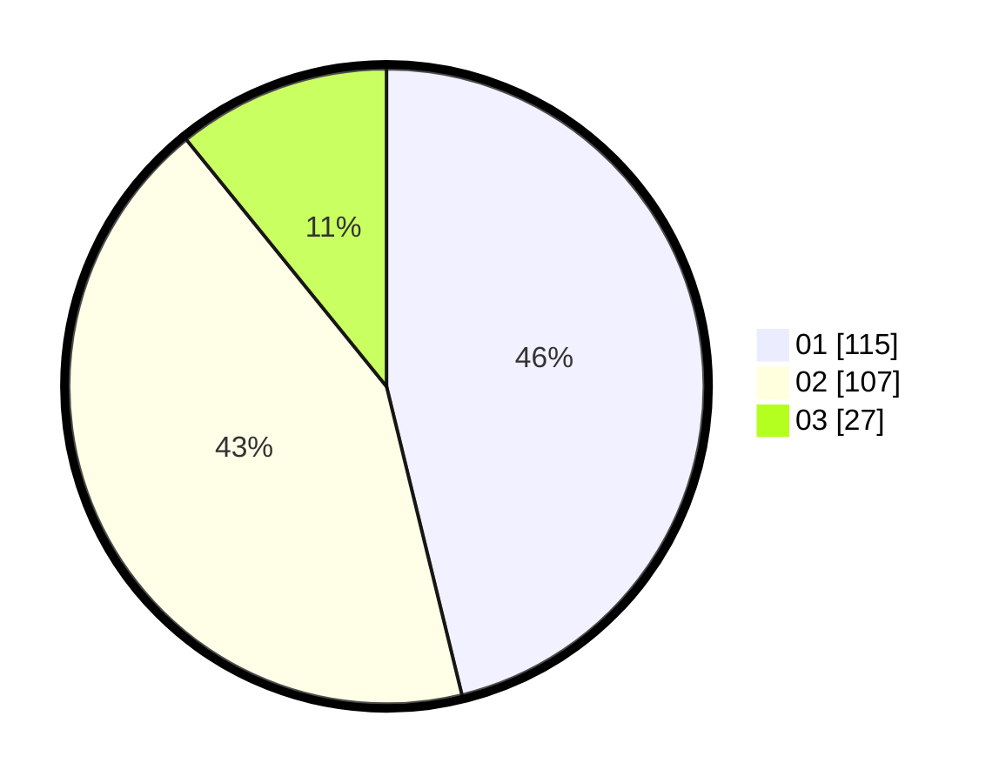

# Hasil

Hasil perolehan suara paslon dapat dilihat pada file paslon-01.txt, paslon-02.txt, dan paslon-03.txt.

Jika tidak ada, artinya data tersebut belum ada pada SIREKAP.

## Perolehan Suara

 * Paslon 01: **115**.
 * Paslon 02: **107**.
 * Paslon 03: **27**.

## Foto C Plano

https://sirekap-obj-formc.kpu.go.id/fc0d/pemilu/ppwp/31/75/03/10/05/3175031005058-20240216-022102--ccdc3e15-de93-4449-859f-d017fc117ebb.jpg

https://sirekap-obj-formc.kpu.go.id/fc0d/pemilu/ppwp/31/75/03/10/05/3175031005058-20240216-020817--94617436-44fa-41d1-bde8-bd6d54aa4dbc.jpg

https://sirekap-obj-formc.kpu.go.id/fc0d/pemilu/ppwp/31/75/03/10/05/3175031005058-20240216-023956--66afb499-2e02-41d8-b0a9-4f257a0296a5.jpg

## DATA PEMILIH TETAP

Jumlah pemilih dalam DPT: **289**.
 * L: **152**.
 * P: **137**.

## DATA PENGGUNA HAK PILIH

Jumlah pengguna hak pilih dalam DPT: **246**.
 * L: **129**.
 * P: **117**.

Jumlah pengguna hak pilih dalam DPTb: **9**.
 * L: **6**.
 * P: **3**.

Jumlah pengguna hak pilih dalam DPK: **0**.
 * L: **0**.
 * P: **0**.

Jumlah pengguna hak pilih: **255**.
 * L: **135**.
 * P: **120**.

## JUMLAH SUARA SAH DAN TIDAK SAH

JUMLAH SELURUH SUARA SAH: **249**.

JUMLAH SUARA TIDAK SAH: **6**.

JUMLAH SELURUH SUARA SAH DAN SUARA TIDAK SAH: **255**.
