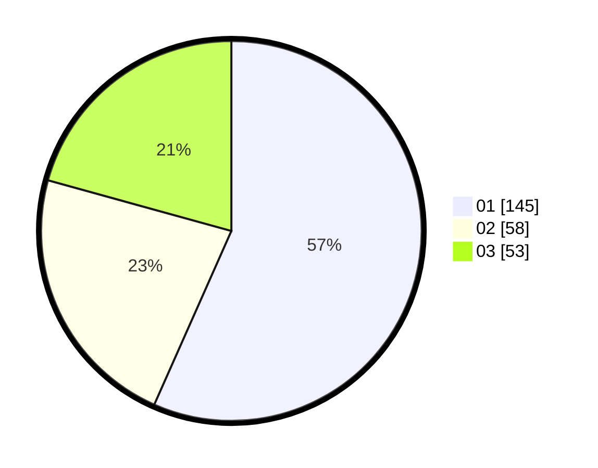

# Hasil

Hasil perolehan suara paslon dapat dilihat pada file paslon-01.txt, paslon-02.txt, dan paslon-03.txt.

Jika tidak ada, artinya data tersebut belum ada pada SIREKAP.

## Perolehan Suara

 * Paslon 01: **145**.
 * Paslon 02: **58**.
 * Paslon 03: **53**.

## Foto C Plano

https://sirekap-obj-formc.kpu.go.id/1bc3/pemilu/ppwp/31/75/03/10/05/3175031005061-20240216-124206--3d2726e9-f3cb-42e5-8163-16df84e1dead.jpg

https://sirekap-obj-formc.kpu.go.id/1bc3/pemilu/ppwp/31/75/03/10/05/3175031005061-20240216-124209--9a8febf0-7c9c-4537-b2e3-8a8c4d021ab8.jpg

https://sirekap-obj-formc.kpu.go.id/1bc3/pemilu/ppwp/31/75/03/10/05/3175031005061-20240216-124208--a2137867-f7d8-41c6-9dee-bda811d5df5e.jpg

## DATA PEMILIH TETAP

Jumlah pemilih dalam DPT: **290**.
 * L: **138**.
 * P: **152**.

## DATA PENGGUNA HAK PILIH

Jumlah pengguna hak pilih dalam DPT: **242**.
 * L: **118**.
 * P: **124**.

Jumlah pengguna hak pilih dalam DPTb: **15**.
 * L: **10**.
 * P: **5**.

Jumlah pengguna hak pilih dalam DPK: **1**.
 * L: **1**.
 * P: **0**.

Jumlah pengguna hak pilih: **258**.
 * L: **129**.
 * P: **129**.

## JUMLAH SUARA SAH DAN TIDAK SAH

JUMLAH SELURUH SUARA SAH: **256**.

JUMLAH SUARA TIDAK SAH: **2**.

JUMLAH SELURUH SUARA SAH DAN SUARA TIDAK SAH: **258**.
