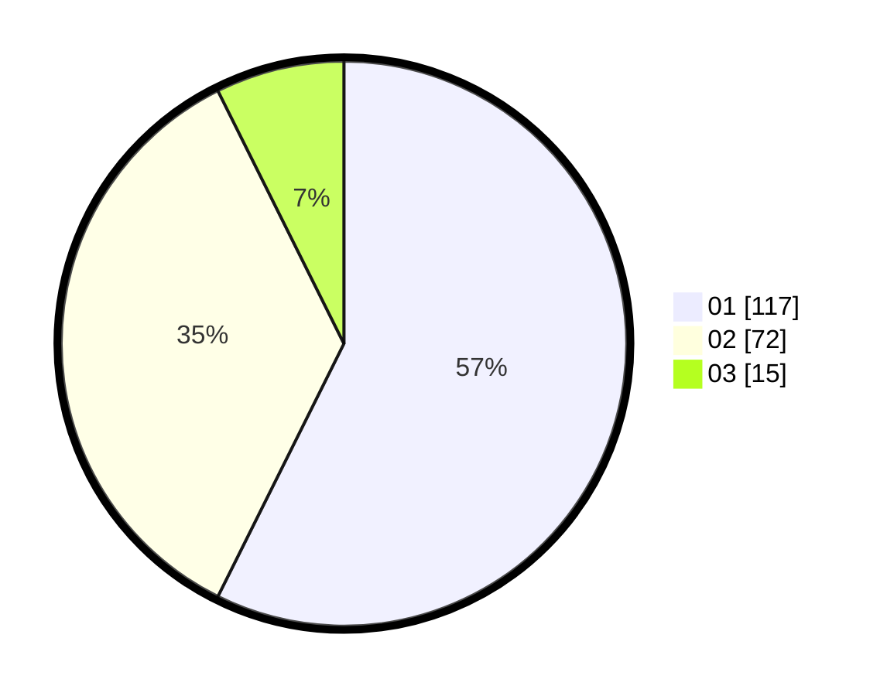

# Hasil

Hasil perolehan suara paslon dapat dilihat pada file paslon-01.txt, paslon-02.txt, dan paslon-03.txt.

Jika tidak ada, artinya data tersebut belum ada pada SIREKAP.

## Perolehan Suara

 * Paslon 01: **117**.
 * Paslon 02: **72**.
 * Paslon 03: **15**.

## Foto C Plano

https://sirekap-obj-formc.kpu.go.id/3681/pemilu/ppwp/31/75/03/10/05/3175031005068-20240215-025057--712fc2c4-1055-4282-9eab-3c1516955b89.jpg

https://sirekap-obj-formc.kpu.go.id/3681/pemilu/ppwp/31/75/03/10/05/3175031005068-20240215-025127--f3c42828-117c-46cc-8280-fa1e16bf6e92.jpg

https://sirekap-obj-formc.kpu.go.id/3681/pemilu/ppwp/31/75/03/10/05/3175031005068-20240215-025109--76b88e5d-0860-4982-b025-ea696f8303f0.jpg

## DATA PEMILIH TETAP

Jumlah pemilih dalam DPT: **264**.
 * L: **141**.
 * P: **123**.

## DATA PENGGUNA HAK PILIH

Jumlah pengguna hak pilih dalam DPT: **202**.
 * L: **106**.
 * P: **96**.

Jumlah pengguna hak pilih dalam DPTb: **1**.
 * L: **0**.
 * P: **1**.

Jumlah pengguna hak pilih dalam DPK: **2**.
 * L: **0**.
 * P: **2**.

Jumlah pengguna hak pilih: **205**.
 * L: **106**.
 * P: **99**.

## JUMLAH SUARA SAH DAN TIDAK SAH

JUMLAH SELURUH SUARA SAH: **204**.

JUMLAH SUARA TIDAK SAH: **1**.

JUMLAH SELURUH SUARA SAH DAN SUARA TIDAK SAH: **205**.
