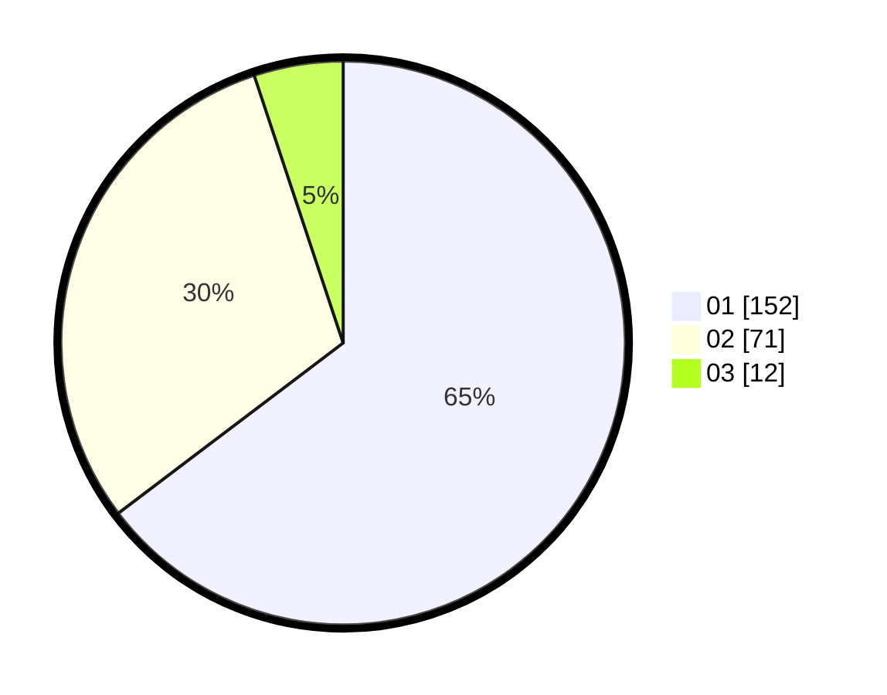

# Hasil

Hasil perolehan suara paslon dapat dilihat pada file paslon-01.txt, paslon-02.txt, dan paslon-03.txt.

Jika tidak ada, artinya data tersebut belum ada pada SIREKAP.

## Perolehan Suara

 * Paslon 01: **152**.
 * Paslon 02: **71**.
 * Paslon 03: **12**.

## Foto C Plano

https://sirekap-obj-formc.kpu.go.id/6de2/pemilu/ppwp/31/75/03/10/05/3175031005071-20240214-205226--4d4bd4f9-32bf-4e95-9b0e-a71961a46b03.jpg

https://sirekap-obj-formc.kpu.go.id/6de2/pemilu/ppwp/31/75/03/10/05/3175031005071-20240216-153916--332bf6e0-14e9-4371-a6a6-9d64d6e12389.jpg

https://sirekap-obj-formc.kpu.go.id/6de2/pemilu/ppwp/31/75/03/10/05/3175031005071-20240214-205306--378499ee-b1a4-4576-9ebf-db01ec6a0ae1.jpg

## DATA PEMILIH TETAP

Jumlah pemilih dalam DPT: **270**.
 * L: **133**.
 * P: **137**.

## DATA PENGGUNA HAK PILIH

Jumlah pengguna hak pilih dalam DPT: **229**.
 * L: **112**.
 * P: **117**.

Jumlah pengguna hak pilih dalam DPTb: **3**.
 * L: **2**.
 * P: **1**.

Jumlah pengguna hak pilih dalam DPK: **3**.
 * L: **2**.
 * P: **1**.

Jumlah pengguna hak pilih: **235**.
 * L: **116**.
 * P: **119**.

## JUMLAH SUARA SAH DAN TIDAK SAH

JUMLAH SELURUH SUARA SAH: **234**.

JUMLAH SUARA TIDAK SAH: **1**.

JUMLAH SELURUH SUARA SAH DAN SUARA TIDAK SAH: **235**.
