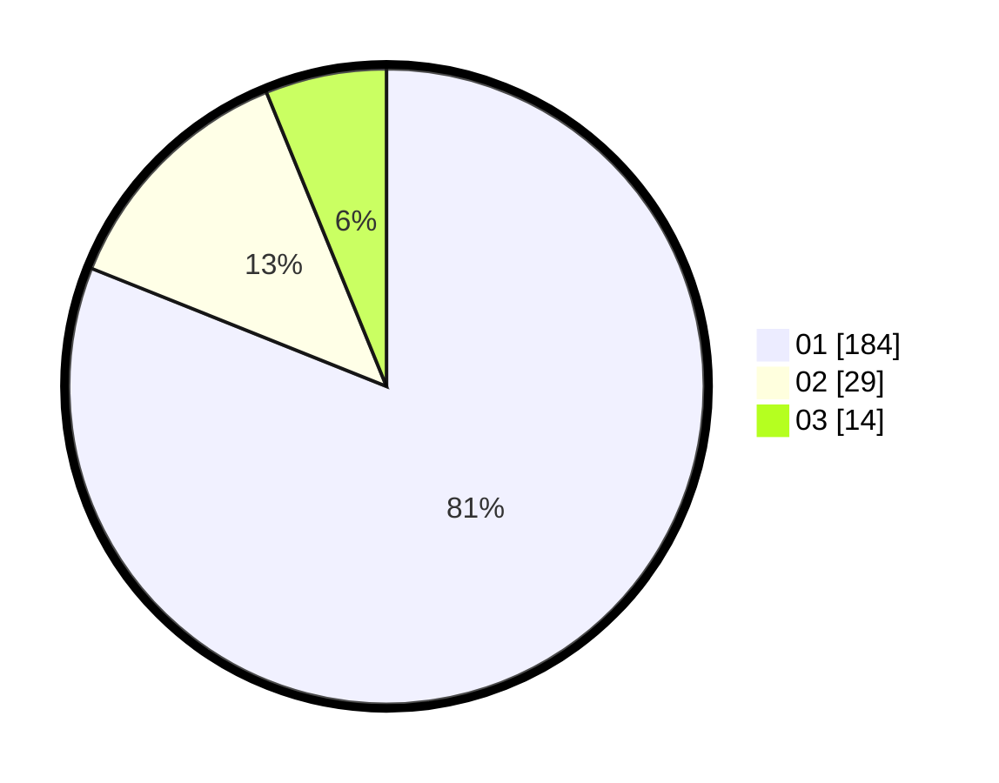

# Hasil

Hasil perolehan suara paslon dapat dilihat pada file paslon-01.txt, paslon-02.txt, dan paslon-03.txt.

Jika tidak ada, artinya data tersebut belum ada pada SIREKAP.

## Perolehan Suara

 * Paslon 01: **184**.
 * Paslon 02: **29**.
 * Paslon 03: **14**.

## Foto C Plano

https://sirekap-obj-formc.kpu.go.id/4267/pemilu/ppwp/31/75/03/10/05/3175031005072-20240216-130857--3d6dc31f-5660-4d36-9e69-9e99f7dc6c17.jpg

https://sirekap-obj-formc.kpu.go.id/4267/pemilu/ppwp/31/75/03/10/05/3175031005072-20240216-130859--e81f1db3-6caa-41a3-9106-23eed74f27ac.jpg

https://sirekap-obj-formc.kpu.go.id/4267/pemilu/ppwp/31/75/03/10/05/3175031005072-20240216-130858--4b2ba369-014c-46ef-80b5-78e82a5cde19.jpg

## DATA PEMILIH TETAP

Jumlah pemilih dalam DPT: **227**.
 * L: **103**.
 * P: **124**.

## DATA PENGGUNA HAK PILIH

Jumlah pengguna hak pilih dalam DPT: **227**.
 * L: **103**.
 * P: **124**.

Jumlah pengguna hak pilih dalam DPTb: **3**.
 * L: **1**.
 * P: **2**.

Jumlah pengguna hak pilih dalam DPK: **1**.
 * L: **1**.
 * P: **0**.

Jumlah pengguna hak pilih: **231**.
 * L: **105**.
 * P: **126**.

## JUMLAH SUARA SAH DAN TIDAK SAH

JUMLAH SELURUH SUARA SAH: **227**.

JUMLAH SUARA TIDAK SAH: **4**.

JUMLAH SELURUH SUARA SAH DAN SUARA TIDAK SAH: **231**.
