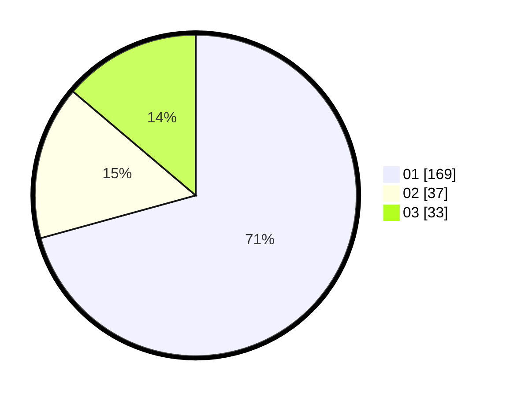

# Hasil

Hasil perolehan suara paslon dapat dilihat pada file paslon-01.txt, paslon-02.txt, dan paslon-03.txt.

Jika tidak ada, artinya data tersebut belum ada pada SIREKAP.

## Perolehan Suara

 * Paslon 01: **169**.
 * Paslon 02: **37**.
 * Paslon 03: **33**.

## Foto C Plano

https://sirekap-obj-formc.kpu.go.id/dc47/pemilu/ppwp/31/75/03/10/05/3175031005074-20240216-124220--8b70ba25-28fd-4b94-8ea6-16d2cff83c16.jpg

https://sirekap-obj-formc.kpu.go.id/dc47/pemilu/ppwp/31/75/03/10/05/3175031005074-20240216-124221--3348aa86-1b44-4e63-a64a-4e35e6ffea98.jpg

https://sirekap-obj-formc.kpu.go.id/dc47/pemilu/ppwp/31/75/03/10/05/3175031005074-20240216-124220--76357f94-147a-4ed9-8e28-32217506a82c.jpg

## DATA PEMILIH TETAP

Jumlah pemilih dalam DPT: **276**.
 * L: **132**.
 * P: **144**.

## DATA PENGGUNA HAK PILIH

Jumlah pengguna hak pilih dalam DPT: **238**.
 * L: **110**.
 * P: **128**.

Jumlah pengguna hak pilih dalam DPTb: **0**.
 * L: **0**.
 * P: **0**.

Jumlah pengguna hak pilih dalam DPK: **0**.
 * L: **0**.
 * P: **0**.

Jumlah pengguna hak pilih: **239**.
 * L: **111**.
 * P: **128**.

## JUMLAH SUARA SAH DAN TIDAK SAH

JUMLAH SELURUH SUARA SAH: **239**.

JUMLAH SUARA TIDAK SAH: **0**.

JUMLAH SELURUH SUARA SAH DAN SUARA TIDAK SAH: **239**.
