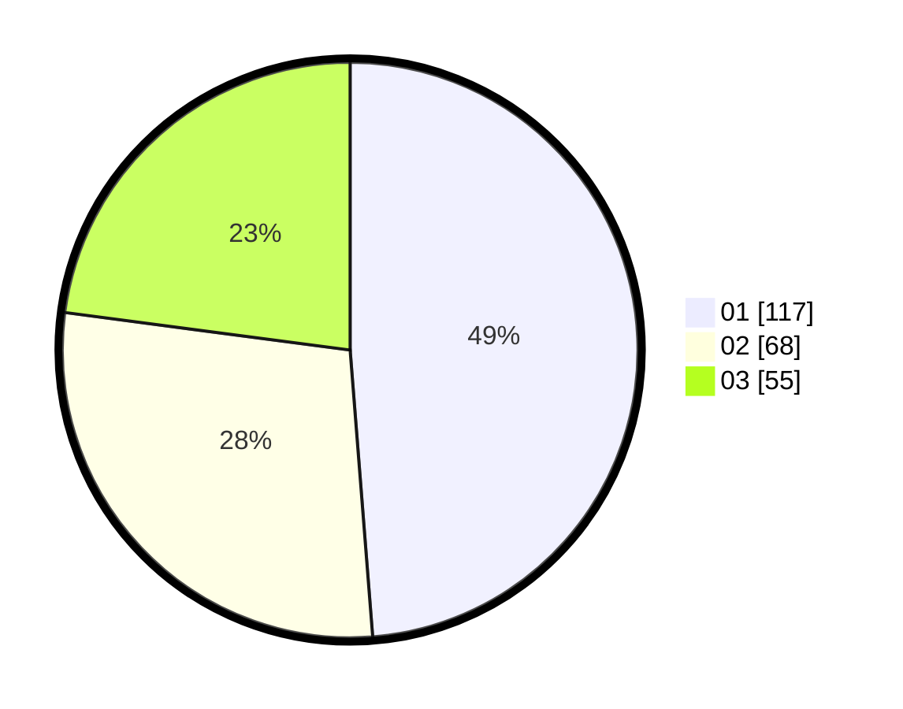

# Hasil

Hasil perolehan suara paslon dapat dilihat pada file paslon-01.txt, paslon-02.txt, dan paslon-03.txt.

Jika tidak ada, artinya data tersebut belum ada pada SIREKAP.

## Perolehan Suara

 * Paslon 01: **117**.
 * Paslon 02: **68**.
 * Paslon 03: **55**.

## Foto C Plano

https://sirekap-obj-formc.kpu.go.id/2d2a/pemilu/ppwp/31/75/03/10/05/3175031005076-20240216-145534--ec6a9371-8460-4ab3-8309-4856f8051b87.jpg

https://sirekap-obj-formc.kpu.go.id/2d2a/pemilu/ppwp/31/75/03/10/05/3175031005076-20240216-145535--e9c416dc-d414-4bf6-9ff9-da2b57123771.jpg

https://sirekap-obj-formc.kpu.go.id/2d2a/pemilu/ppwp/31/75/03/10/05/3175031005076-20240216-145534--bd554fcf-8f26-4d1d-a28e-b38b187ccdb0.jpg

## DATA PEMILIH TETAP

Jumlah pemilih dalam DPT: **295**.
 * L: **154**.
 * P: **141**.

## DATA PENGGUNA HAK PILIH

Jumlah pengguna hak pilih dalam DPT: **225**.
 * L: **110**.
 * P: **115**.

Jumlah pengguna hak pilih dalam DPTb: **15**.
 * L: **4**.
 * P: **11**.

Jumlah pengguna hak pilih dalam DPK: **3**.
 * L: **1**.
 * P: **2**.

Jumlah pengguna hak pilih: **243**.
 * L: **115**.
 * P: **128**.

## JUMLAH SUARA SAH DAN TIDAK SAH

JUMLAH SELURUH SUARA SAH: **240**.

JUMLAH SUARA TIDAK SAH: **2**.

JUMLAH SELURUH SUARA SAH DAN SUARA TIDAK SAH: **242**.
