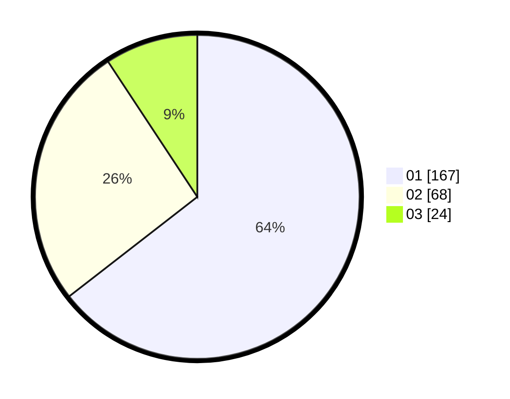

# Hasil

Hasil perolehan suara paslon dapat dilihat pada file paslon-01.txt, paslon-02.txt, dan paslon-03.txt.

Jika tidak ada, artinya data tersebut belum ada pada SIREKAP.

## Perolehan Suara

 * Paslon 01: **167**.
 * Paslon 02: **68**.
 * Paslon 03: **24**.

## Foto C Plano

https://sirekap-obj-formc.kpu.go.id/c525/pemilu/ppwp/31/75/03/10/05/3175031005077-20240214-214224--82319d5a-0168-4399-83ca-4df777574782.jpg

https://sirekap-obj-formc.kpu.go.id/c525/pemilu/ppwp/31/75/03/10/05/3175031005077-20240216-061818--b8350648-0823-469f-b2f2-299f23e8bdda.jpg

https://sirekap-obj-formc.kpu.go.id/c525/pemilu/ppwp/31/75/03/10/05/3175031005077-20240216-061817--6ca5818e-030d-4f0a-8453-dbbfe99948c3.jpg
