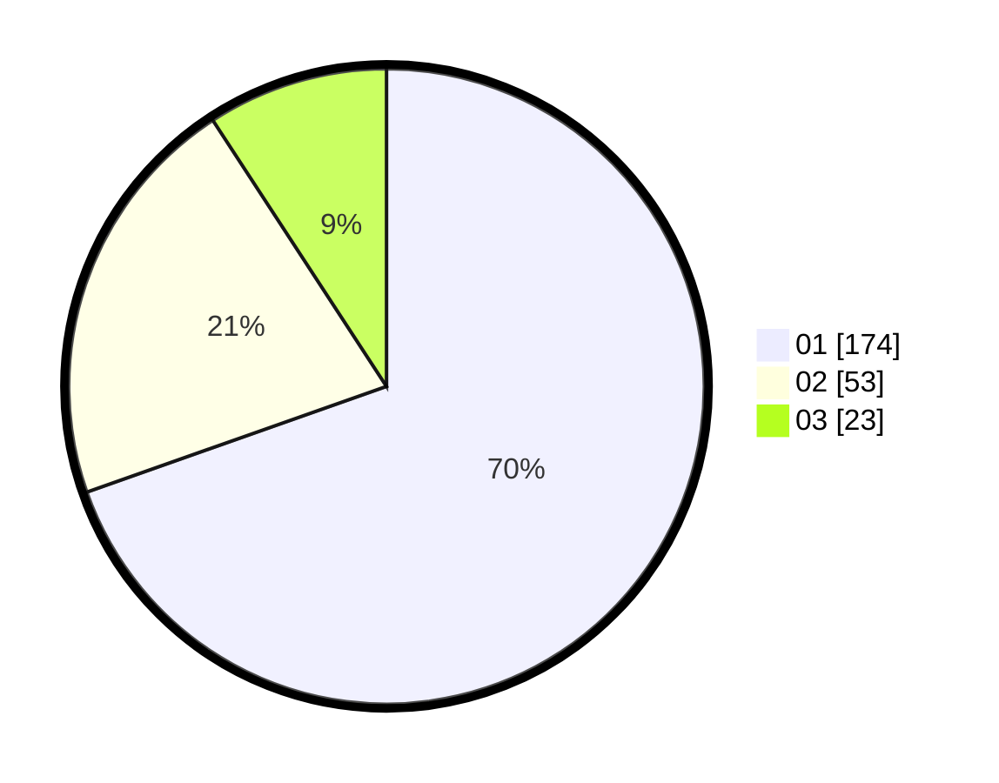

# Hasil

Hasil perolehan suara paslon dapat dilihat pada file paslon-01.txt, paslon-02.txt, dan paslon-03.txt.

Jika tidak ada, artinya data tersebut belum ada pada SIREKAP.

## Perolehan Suara

 * Paslon 01: **174**.
 * Paslon 02: **53**.
 * Paslon 03: **23**.

## Foto C Plano

https://sirekap-obj-formc.kpu.go.id/4590/pemilu/ppwp/31/75/03/10/05/3175031005078-20240214-155245--aa346eb2-d4e8-4243-9f11-8d1a1b746ed2.jpg

https://sirekap-obj-formc.kpu.go.id/4590/pemilu/ppwp/31/75/03/10/05/3175031005078-20240214-155550--d2246857-cb74-490a-afa5-4ea510957157.jpg

https://sirekap-obj-formc.kpu.go.id/4590/pemilu/ppwp/31/75/03/10/05/3175031005078-20240214-195107--f4e3713a-d55a-4137-b170-e51834792d16.jpg

## DATA PEMILIH TETAP

Jumlah pemilih dalam DPT: **295**.
 * L: **135**.
 * P: **160**.

## DATA PENGGUNA HAK PILIH

Jumlah pengguna hak pilih dalam DPT: **233**.
 * L: **100**.
 * P: **133**.

Jumlah pengguna hak pilih dalam DPTb: **18**.
 * L: **14**.
 * P: **4**.

Jumlah pengguna hak pilih dalam DPK: **1**.
 * L: **1**.
 * P: **0**.

Jumlah pengguna hak pilih: **252**.
 * L: **115**.
 * P: **137**.

## JUMLAH SUARA SAH DAN TIDAK SAH

JUMLAH SELURUH SUARA SAH: **250**.

JUMLAH SUARA TIDAK SAH: **2**.

JUMLAH SELURUH SUARA SAH DAN SUARA TIDAK SAH: **252**.
