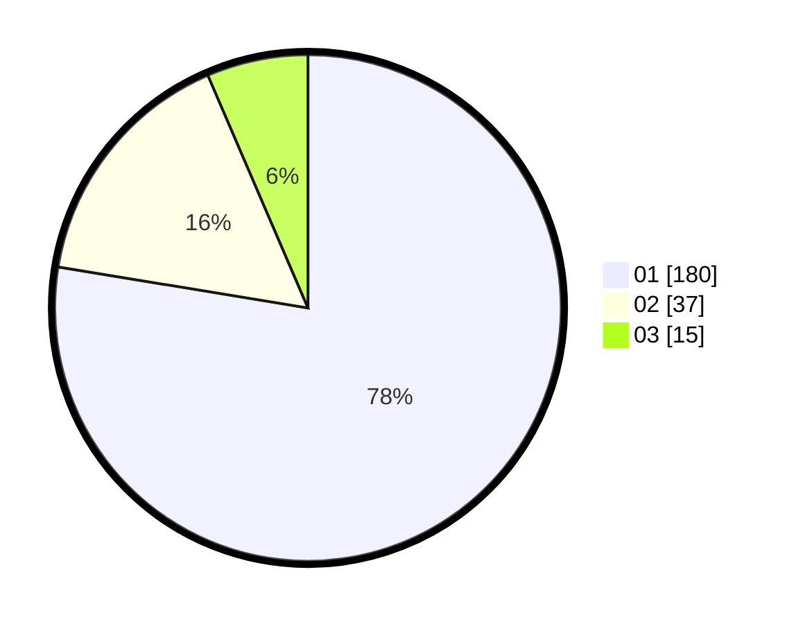

# Hasil

Hasil perolehan suara paslon dapat dilihat pada file paslon-01.txt, paslon-02.txt, dan paslon-03.txt.

Jika tidak ada, artinya data tersebut belum ada pada SIREKAP.

## Perolehan Suara

 * Paslon 01: **180**.
 * Paslon 02: **37**.
 * Paslon 03: **15**.

## Foto C Plano

https://sirekap-obj-formc.kpu.go.id/b34f/pemilu/ppwp/31/75/03/10/05/3175031005081-20240216-033637--a1727322-7839-442d-a215-ca754d8c3a49.jpg

https://sirekap-obj-formc.kpu.go.id/b34f/pemilu/ppwp/31/75/03/10/05/3175031005081-20240216-033649--4ce89ece-6291-462b-9f81-44e788e33149.jpg

https://sirekap-obj-formc.kpu.go.id/b34f/pemilu/ppwp/31/75/03/10/05/3175031005081-20240216-033645--5524c2c4-6573-492d-b52f-8cd78d057d39.jpg

## DATA PEMILIH TETAP

Jumlah pemilih dalam DPT: **295**.
 * L: **150**.
 * P: **145**.

## DATA PENGGUNA HAK PILIH

Jumlah pengguna hak pilih dalam DPT: **225**.
 * L: **115**.
 * P: **110**.

Jumlah pengguna hak pilih dalam DPTb: **4**.
 * L: **3**.
 * P: **1**.

Jumlah pengguna hak pilih dalam DPK: **3**.
 * L: **2**.
 * P: **1**.

Jumlah pengguna hak pilih: **232**.
 * L: **120**.
 * P: **112**.

## JUMLAH SUARA SAH DAN TIDAK SAH

JUMLAH SELURUH SUARA SAH: **232**.

JUMLAH SUARA TIDAK SAH: **0**.

JUMLAH SELURUH SUARA SAH DAN SUARA TIDAK SAH: **232**.
