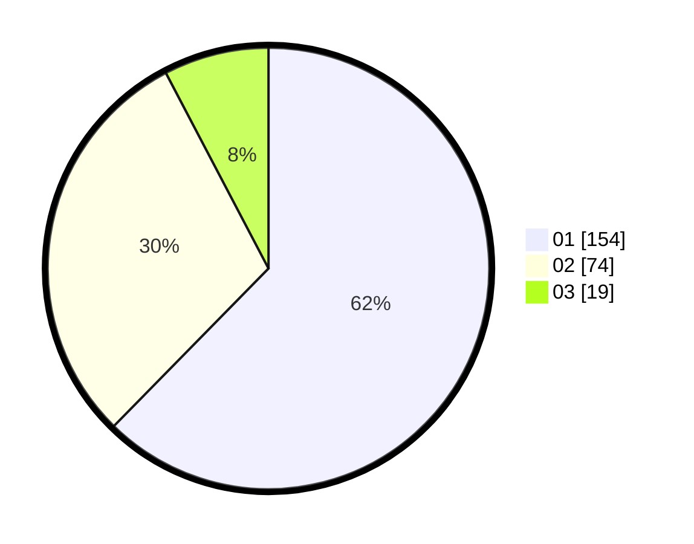

# Hasil

Hasil perolehan suara paslon dapat dilihat pada file paslon-01.txt, paslon-02.txt, dan paslon-03.txt.

Jika tidak ada, artinya data tersebut belum ada pada SIREKAP.

## Perolehan Suara

 * Paslon 01: **154**.
 * Paslon 02: **74**.
 * Paslon 03: **19**.

## Foto C Plano

https://sirekap-obj-formc.kpu.go.id/2bad/pemilu/ppwp/31/75/03/10/05/3175031005084-20240215-005345--69584319-42b7-48c1-b1c2-2e185f979a14.jpg

https://sirekap-obj-formc.kpu.go.id/2bad/pemilu/ppwp/31/75/03/10/05/3175031005084-20240215-005440--5057345d-70b3-48ba-99d0-bb4a7a6124ee.jpg

https://sirekap-obj-formc.kpu.go.id/2bad/pemilu/ppwp/31/75/03/10/05/3175031005084-20240215-005525--26a795b3-b395-486d-8041-4aa5b1e5a135.jpg

## DATA PEMILIH TETAP

Jumlah pemilih dalam DPT: **296**.
 * L: **140**.
 * P: **156**.

## DATA PENGGUNA HAK PILIH

Jumlah pengguna hak pilih dalam DPT: **238**.
 * L: **106**.
 * P: **132**.

Jumlah pengguna hak pilih dalam DPTb: **11**.
 * L: **5**.
 * P: **6**.

Jumlah pengguna hak pilih dalam DPK: **0**.
 * L: **0**.
 * P: **0**.

Jumlah pengguna hak pilih: **249**.
 * L: **111**.
 * P: **138**.

## JUMLAH SUARA SAH DAN TIDAK SAH

JUMLAH SELURUH SUARA SAH: **247**.

JUMLAH SUARA TIDAK SAH: **2**.

JUMLAH SELURUH SUARA SAH DAN SUARA TIDAK SAH: **249**.
