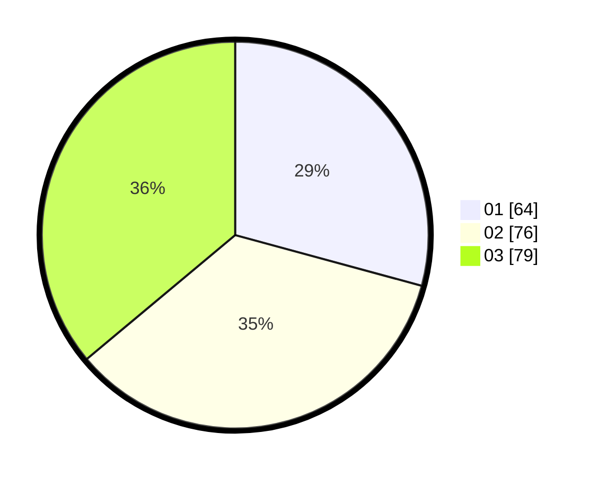

# Hasil

Hasil perolehan suara paslon dapat dilihat pada file paslon-01.txt, paslon-02.txt, dan paslon-03.txt.

Jika tidak ada, artinya data tersebut belum ada pada SIREKAP.

## Perolehan Suara

 * Paslon 01: **64**.
 * Paslon 02: **76**.
 * Paslon 03: **79**.

## Foto C Plano

https://sirekap-obj-formc.kpu.go.id/911c/pemilu/ppwp/31/75/03/10/05/3175031005091-20240214-194334--b7566410-11c6-4c11-9fbb-87ed3c59a3d9.jpg

https://sirekap-obj-formc.kpu.go.id/911c/pemilu/ppwp/31/75/03/10/05/3175031005091-20240214-155224--99c915cf-6a22-4647-89a6-3cbc659d7eb9.jpg

https://sirekap-obj-formc.kpu.go.id/911c/pemilu/ppwp/31/75/03/10/05/3175031005091-20240214-231839--940165f7-f9d1-4683-8fb6-60079c41be1d.jpg

## DATA PEMILIH TETAP

Jumlah pemilih dalam DPT: **271**.
 * L: **134**.
 * P: **137**.

## DATA PENGGUNA HAK PILIH

Jumlah pengguna hak pilih dalam DPT: **202**.
 * L: **104**.
 * P: **98**.

Jumlah pengguna hak pilih dalam DPTb: **20**.
 * L: **10**.
 * P: **10**.

Jumlah pengguna hak pilih dalam DPK: **2**.
 * L: **0**.
 * P: **2**.

Jumlah pengguna hak pilih: **224**.
 * L: **114**.
 * P: **110**.

## JUMLAH SUARA SAH DAN TIDAK SAH

JUMLAH SELURUH SUARA SAH: **219**.

JUMLAH SUARA TIDAK SAH: **5**.

JUMLAH SELURUH SUARA SAH DAN SUARA TIDAK SAH: **224**.
