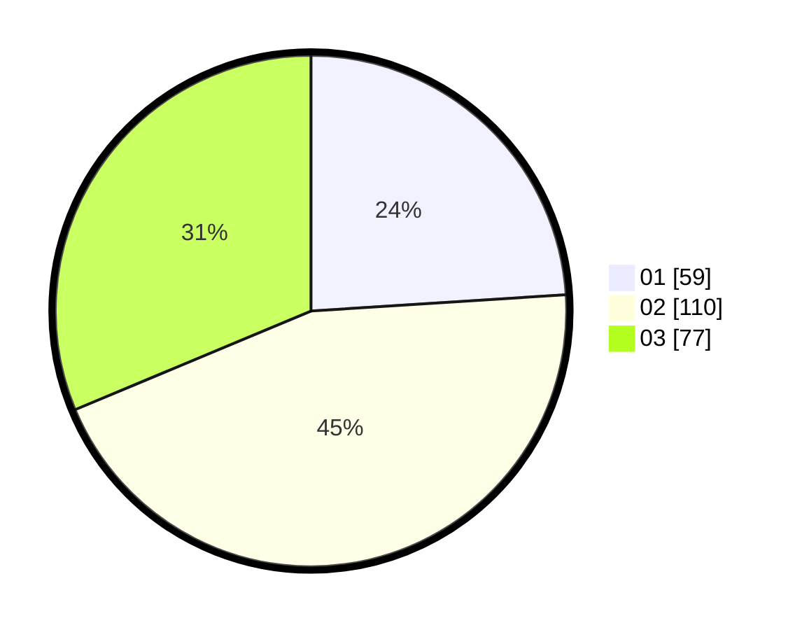

# Hasil

Hasil perolehan suara paslon dapat dilihat pada file paslon-01.txt, paslon-02.txt, dan paslon-03.txt.

Jika tidak ada, artinya data tersebut belum ada pada SIREKAP.

## Perolehan Suara

 * Paslon 01: **59**.
 * Paslon 02: **110**.
 * Paslon 03: **77**.

## Foto C Plano

https://sirekap-obj-formc.kpu.go.id/760a/pemilu/ppwp/31/75/03/10/05/3175031005095-20240216-045203--b4b5a8bc-ebe2-40a6-a13b-b093d5fe9200.jpg

https://sirekap-obj-formc.kpu.go.id/760a/pemilu/ppwp/31/75/03/10/05/3175031005095-20240214-155024--a17a47b8-5153-4530-af48-65fb6ae76654.jpg

https://sirekap-obj-formc.kpu.go.id/760a/pemilu/ppwp/31/75/03/10/05/3175031005095-20240214-155113--07cd5394-cd66-4812-a3ed-e390bd020b6e.jpg

## DATA PEMILIH TETAP

Jumlah pemilih dalam DPT: **0**.
 * L: **0**.
 * P: **0**.

## DATA PENGGUNA HAK PILIH

Jumlah pengguna hak pilih dalam DPT: **0**.
 * L: **0**.
 * P: **0**.

Jumlah pengguna hak pilih dalam DPTb: **0**.
 * L: **0**.
 * P: **0**.

Jumlah pengguna hak pilih dalam DPK: **0**.
 * L: **0**.
 * P: **0**.

Jumlah pengguna hak pilih: **0**.
 * L: **0**.
 * P: **0**.

## JUMLAH SUARA SAH DAN TIDAK SAH

JUMLAH SELURUH SUARA SAH: **246**.

JUMLAH SUARA TIDAK SAH: **2**.

JUMLAH SELURUH SUARA SAH DAN SUARA TIDAK SAH: **248**.
