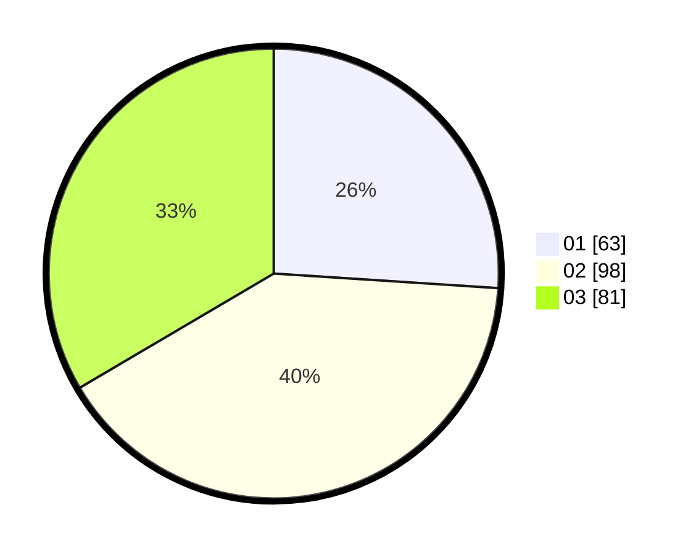

# Hasil

Hasil perolehan suara paslon dapat dilihat pada file paslon-01.txt, paslon-02.txt, dan paslon-03.txt.

Jika tidak ada, artinya data tersebut belum ada pada SIREKAP.

## Perolehan Suara

 * Paslon 01: **63**.
 * Paslon 02: **98**.
 * Paslon 03: **81**.

## Foto C Plano

https://sirekap-obj-formc.kpu.go.id/47d8/pemilu/ppwp/31/75/03/10/05/3175031005096-20240216-073744--a882335c-1353-4746-9f04-3014156dad3d.jpg

https://sirekap-obj-formc.kpu.go.id/47d8/pemilu/ppwp/31/75/03/10/05/3175031005096-20240216-073746--bbbab7e6-439a-4a03-8ee4-4d8a017e4018.jpg

https://sirekap-obj-formc.kpu.go.id/47d8/pemilu/ppwp/31/75/03/10/05/3175031005096-20240216-073745--2aedc428-1c43-45eb-9482-f2ea98304cd5.jpg

## DATA PEMILIH TETAP

Jumlah pemilih dalam DPT: **290**.
 * L: **131**.
 * P: **159**.

## DATA PENGGUNA HAK PILIH

Jumlah pengguna hak pilih dalam DPT: **227**.
 * L: **102**.
 * P: **125**.

Jumlah pengguna hak pilih dalam DPTb: **19**.
 * L: **8**.
 * P: **11**.

Jumlah pengguna hak pilih dalam DPK: **1**.
 * L: **0**.
 * P: **1**.

Jumlah pengguna hak pilih: **247**.
 * L: **110**.
 * P: **137**.

## JUMLAH SUARA SAH DAN TIDAK SAH

JUMLAH SELURUH SUARA SAH: **242**.

JUMLAH SUARA TIDAK SAH: **5**.

JUMLAH SELURUH SUARA SAH DAN SUARA TIDAK SAH: **247**.
