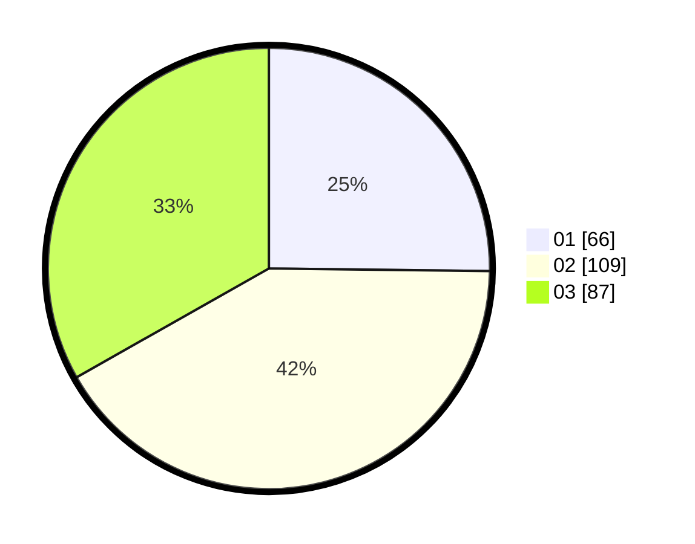

# Hasil

Hasil perolehan suara paslon dapat dilihat pada file paslon-01.txt, paslon-02.txt, dan paslon-03.txt.

Jika tidak ada, artinya data tersebut belum ada pada SIREKAP.

## Perolehan Suara

 * Paslon 01: **66**.
 * Paslon 02: **109**.
 * Paslon 03: **87**.

## Foto C Plano

https://sirekap-obj-formc.kpu.go.id/9b05/pemilu/ppwp/31/75/03/10/05/3175031005097-20240215-235028--e9f04346-9cdf-4276-b0b0-6e335a5eb22c.jpg

https://sirekap-obj-formc.kpu.go.id/9b05/pemilu/ppwp/31/75/03/10/05/3175031005097-20240215-235031--f5e7c9ab-402b-4981-b13d-5b3de1aa0fbd.jpg

https://sirekap-obj-formc.kpu.go.id/9b05/pemilu/ppwp/31/75/03/10/05/3175031005097-20240215-235030--a9348025-a807-49b4-8240-d71866aa642b.jpg

## DATA PEMILIH TETAP

Jumlah pemilih dalam DPT: **292**.
 * L: **137**.
 * P: **155**.

## DATA PENGGUNA HAK PILIH

Jumlah pengguna hak pilih dalam DPT: **241**.
 * L: **115**.
 * P: **126**.

Jumlah pengguna hak pilih dalam DPTb: **19**.
 * L: **9**.
 * P: **10**.

Jumlah pengguna hak pilih dalam DPK: **5**.
 * L: **2**.
 * P: **3**.

Jumlah pengguna hak pilih: **265**.
 * L: **126**.
 * P: **139**.

## JUMLAH SUARA SAH DAN TIDAK SAH

JUMLAH SELURUH SUARA SAH: **262**.

JUMLAH SUARA TIDAK SAH: **3**.

JUMLAH SELURUH SUARA SAH DAN SUARA TIDAK SAH: **265**.
