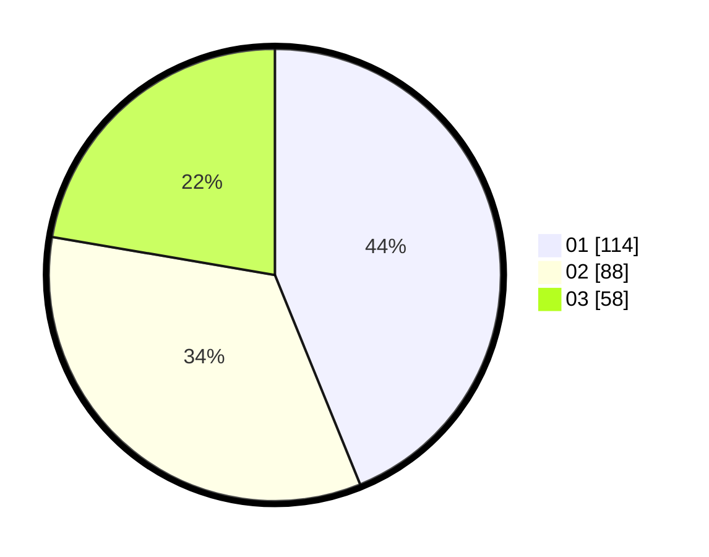

# Hasil

Hasil perolehan suara paslon dapat dilihat pada file paslon-01.txt, paslon-02.txt, dan paslon-03.txt.

Jika tidak ada, artinya data tersebut belum ada pada SIREKAP.

## Perolehan Suara

 * Paslon 01: **114**.
 * Paslon 02: **88**.
 * Paslon 03: **58**.

## Foto C Plano

https://sirekap-obj-formc.kpu.go.id/303b/pemilu/ppwp/31/75/03/10/05/3175031005099-20240216-043302--6724ee44-9f7f-422d-a4ab-089bd073a208.jpg

https://sirekap-obj-formc.kpu.go.id/303b/pemilu/ppwp/31/75/03/10/05/3175031005099-20240216-043310--a7633763-a868-46e8-8768-1dfeb8e1bf52.jpg

https://sirekap-obj-formc.kpu.go.id/303b/pemilu/ppwp/31/75/03/10/05/3175031005099-20240216-043306--29bb1fa0-82d4-4206-828d-d705bbdd3f72.jpg

## DATA PEMILIH TETAP

Jumlah pemilih dalam DPT: **298**.
 * L: **143**.
 * P: **155**.

## DATA PENGGUNA HAK PILIH

Jumlah pengguna hak pilih dalam DPT: **243**.
 * L: **117**.
 * P: **126**.

Jumlah pengguna hak pilih dalam DPTb: **16**.
 * L: **14**.
 * P: **2**.

Jumlah pengguna hak pilih dalam DPK: **3**.
 * L: **2**.
 * P: **1**.

Jumlah pengguna hak pilih: **262**.
 * L: **133**.
 * P: **129**.

## JUMLAH SUARA SAH DAN TIDAK SAH

JUMLAH SELURUH SUARA SAH: **260**.

JUMLAH SUARA TIDAK SAH: **2**.

JUMLAH SELURUH SUARA SAH DAN SUARA TIDAK SAH: **262**.
