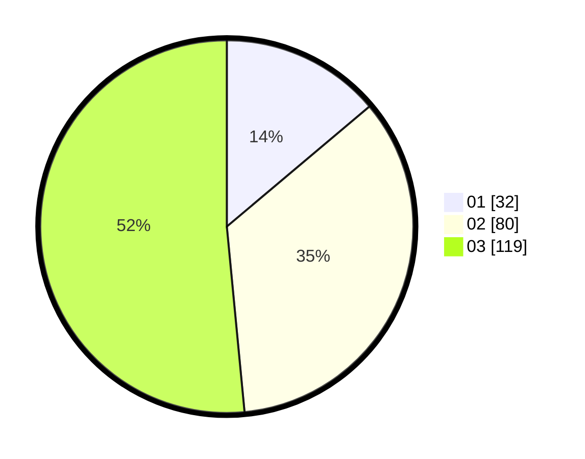

# Hasil

Hasil perolehan suara paslon dapat dilihat pada file paslon-01.txt, paslon-02.txt, dan paslon-03.txt.

Jika tidak ada, artinya data tersebut belum ada pada SIREKAP.

## Perolehan Suara

 * Paslon 01: **32**.
 * Paslon 02: **80**.
 * Paslon 03: **119**.

## Foto C Plano

https://sirekap-obj-formc.kpu.go.id/f711/pemilu/ppwp/31/75/03/10/05/3175031005102-20240216-155539--4684e409-5054-4db5-953a-6d6cff3cacf8.jpg

https://sirekap-obj-formc.kpu.go.id/f711/pemilu/ppwp/31/75/03/10/05/3175031005102-20240216-155541--8c1012a0-3e0c-49a7-8f2b-6bc5cf69cfd3.jpg

https://sirekap-obj-formc.kpu.go.id/f711/pemilu/ppwp/31/75/03/10/05/3175031005102-20240216-155540--dac2c74a-5543-4642-8f67-4169928ba4f5.jpg

## DATA PEMILIH TETAP

Jumlah pemilih dalam DPT: **274**.
 * L: **125**.
 * P: **149**.

## DATA PENGGUNA HAK PILIH

Jumlah pengguna hak pilih dalam DPT: **217**.
 * L: **101**.
 * P: **116**.

Jumlah pengguna hak pilih dalam DPTb: **14**.
 * L: **5**.
 * P: **9**.

Jumlah pengguna hak pilih dalam DPK: **3**.
 * L: **2**.
 * P: **1**.

Jumlah pengguna hak pilih: **234**.
 * L: **108**.
 * P: **126**.

## JUMLAH SUARA SAH DAN TIDAK SAH

JUMLAH SELURUH SUARA SAH: **231**.

JUMLAH SUARA TIDAK SAH: **3**.

JUMLAH SELURUH SUARA SAH DAN SUARA TIDAK SAH: **234**.
