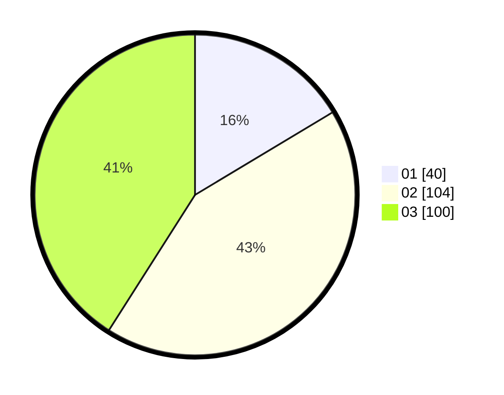

# Hasil

Hasil perolehan suara paslon dapat dilihat pada file paslon-01.txt, paslon-02.txt, dan paslon-03.txt.

Jika tidak ada, artinya data tersebut belum ada pada SIREKAP.

## Perolehan Suara

 * Paslon 01: **40**.
 * Paslon 02: **104**.
 * Paslon 03: **100**.

## Foto C Plano

https://sirekap-obj-formc.kpu.go.id/c731/pemilu/ppwp/31/75/03/10/05/3175031005104-20240216-005221--425b2538-9d61-4809-a2b7-fc9cb2b091e0.jpg

https://sirekap-obj-formc.kpu.go.id/c731/pemilu/ppwp/31/75/03/10/05/3175031005104-20240216-005224--68987a43-b0a9-421c-83ce-93baae3ae9ae.jpg

https://sirekap-obj-formc.kpu.go.id/c731/pemilu/ppwp/31/75/03/10/05/3175031005104-20240216-005223--ecc69c0d-5f74-41db-a9b4-8c9a614e6c16.jpg

## DATA PEMILIH TETAP

Jumlah pemilih dalam DPT: **273**.
 * L: **129**.
 * P: **144**.

## DATA PENGGUNA HAK PILIH

Jumlah pengguna hak pilih dalam DPT: **223**.
 * L: **103**.
 * P: **120**.

Jumlah pengguna hak pilih dalam DPTb: **22**.
 * L: **9**.
 * P: **13**.

Jumlah pengguna hak pilih dalam DPK: **4**.
 * L: **1**.
 * P: **3**.

Jumlah pengguna hak pilih: **249**.
 * L: **113**.
 * P: **136**.

## JUMLAH SUARA SAH DAN TIDAK SAH

JUMLAH SELURUH SUARA SAH: **244**.

JUMLAH SUARA TIDAK SAH: **5**.

JUMLAH SELURUH SUARA SAH DAN SUARA TIDAK SAH: **249**.
