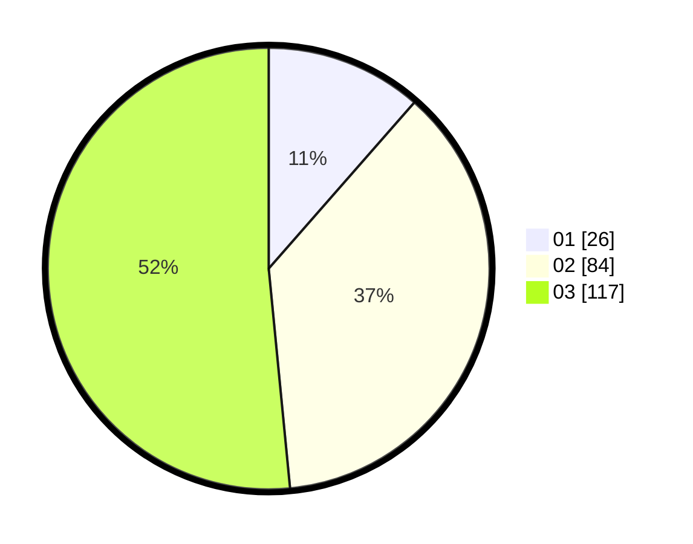

# Hasil

Hasil perolehan suara paslon dapat dilihat pada file paslon-01.txt, paslon-02.txt, dan paslon-03.txt.

Jika tidak ada, artinya data tersebut belum ada pada SIREKAP.

## Perolehan Suara

 * Paslon 01: **26**.
 * Paslon 02: **84**.
 * Paslon 03: **117**.

## Foto C Plano

https://sirekap-obj-formc.kpu.go.id/4efd/pemilu/ppwp/31/75/03/10/05/3175031005105-20240215-060420--4900a678-b491-45ba-bb55-666aaa0de1a5.jpg

https://sirekap-obj-formc.kpu.go.id/4efd/pemilu/ppwp/31/75/03/10/05/3175031005105-20240215-060441--c798931f-f602-4f58-8cd9-2b34d7e4e36c.jpg

https://sirekap-obj-formc.kpu.go.id/4efd/pemilu/ppwp/31/75/03/10/05/3175031005105-20240215-060430--7858e569-3d3f-4bd8-8833-8e50fd386833.jpg

## DATA PEMILIH TETAP

Jumlah pemilih dalam DPT: **276**.
 * L: **123**.
 * P: **153**.

## DATA PENGGUNA HAK PILIH

Jumlah pengguna hak pilih dalam DPT: **212**.
 * L: **90**.
 * P: **122**.

Jumlah pengguna hak pilih dalam DPTb: **15**.
 * L: **6**.
 * P: **9**.

Jumlah pengguna hak pilih dalam DPK: **1**.
 * L: **1**.
 * P: **0**.

Jumlah pengguna hak pilih: **228**.
 * L: **97**.
 * P: **131**.

## JUMLAH SUARA SAH DAN TIDAK SAH

JUMLAH SELURUH SUARA SAH: **227**.

JUMLAH SUARA TIDAK SAH: **1**.

JUMLAH SELURUH SUARA SAH DAN SUARA TIDAK SAH: **228**.
