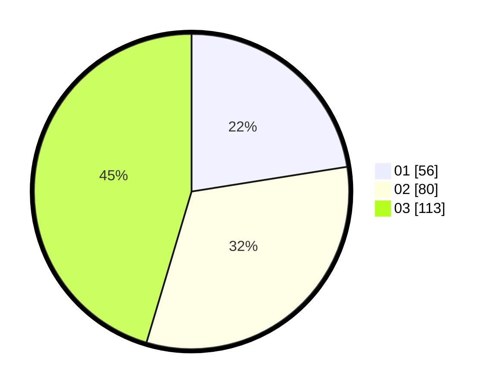

# Hasil

Hasil perolehan suara paslon dapat dilihat pada file paslon-01.txt, paslon-02.txt, dan paslon-03.txt.

Jika tidak ada, artinya data tersebut belum ada pada SIREKAP.

## Perolehan Suara

 * Paslon 01: **56**.
 * Paslon 02: **80**.
 * Paslon 03: **113**.

## Foto C Plano

https://sirekap-obj-formc.kpu.go.id/1ae3/pemilu/ppwp/31/75/03/10/05/3175031005106-20240214-185157--cc495048-794f-4cb0-b89d-cb3068c07172.jpg

https://sirekap-obj-formc.kpu.go.id/1ae3/pemilu/ppwp/31/75/03/10/05/3175031005106-20240214-184526--6454f63a-21ec-4edb-af96-2119f9951e87.jpg

https://sirekap-obj-formc.kpu.go.id/1ae3/pemilu/ppwp/31/75/03/10/05/3175031005106-20240214-184533--c6e1c7d7-e945-4e61-9df7-9a2c644223a6.jpg

## DATA PEMILIH TETAP

Jumlah pemilih dalam DPT: **270**.
 * L: **131**.
 * P: **139**.

## DATA PENGGUNA HAK PILIH

Jumlah pengguna hak pilih dalam DPT: **230**.
 * L: **109**.
 * P: **121**.

Jumlah pengguna hak pilih dalam DPTb: **22**.
 * L: **13**.
 * P: **9**.

Jumlah pengguna hak pilih dalam DPK: **6**.
 * L: **3**.
 * P: **3**.

Jumlah pengguna hak pilih: **258**.
 * L: **125**.
 * P: **133**.

## JUMLAH SUARA SAH DAN TIDAK SAH

JUMLAH SELURUH SUARA SAH: **249**.

JUMLAH SUARA TIDAK SAH: **9**.

JUMLAH SELURUH SUARA SAH DAN SUARA TIDAK SAH: **258**.
