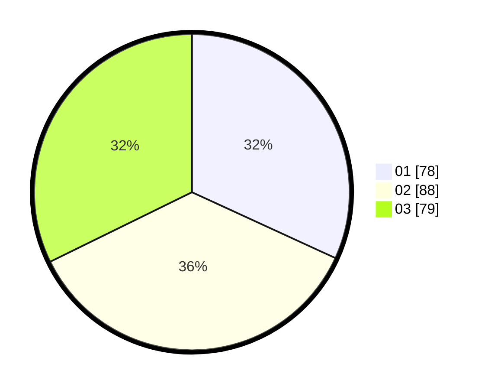

# Hasil

Hasil perolehan suara paslon dapat dilihat pada file paslon-01.txt, paslon-02.txt, dan paslon-03.txt.

Jika tidak ada, artinya data tersebut belum ada pada SIREKAP.

## Perolehan Suara

 * Paslon 01: **78**.
 * Paslon 02: **88**.
 * Paslon 03: **79**.

## Foto C Plano

https://sirekap-obj-formc.kpu.go.id/e180/pemilu/ppwp/31/75/03/10/05/3175031005107-20240215-215319--71128cd2-a2e5-4013-9fe4-592bec4cb126.jpg

https://sirekap-obj-formc.kpu.go.id/e180/pemilu/ppwp/31/75/03/10/05/3175031005107-20240215-215320--c94a4493-70fa-4e23-9642-a50884fc3ce5.jpg

https://sirekap-obj-formc.kpu.go.id/e180/pemilu/ppwp/31/75/03/10/05/3175031005107-20240216-001026--2c0aa902-2d74-4dca-b896-79bc7a9c5696.jpg

## DATA PEMILIH TETAP

Jumlah pemilih dalam DPT: **272**.
 * L: **135**.
 * P: **137**.

## DATA PENGGUNA HAK PILIH

Jumlah pengguna hak pilih dalam DPT: **218**.
 * L: **99**.
 * P: **119**.

Jumlah pengguna hak pilih dalam DPTb: **22**.
 * L: **13**.
 * P: **9**.

Jumlah pengguna hak pilih dalam DPK: **5**.
 * L: **2**.
 * P: **3**.

Jumlah pengguna hak pilih: **245**.
 * L: **114**.
 * P: **131**.

## JUMLAH SUARA SAH DAN TIDAK SAH

JUMLAH SELURUH SUARA SAH: **245**.

JUMLAH SUARA TIDAK SAH: **1**.

JUMLAH SELURUH SUARA SAH DAN SUARA TIDAK SAH: **246**.
