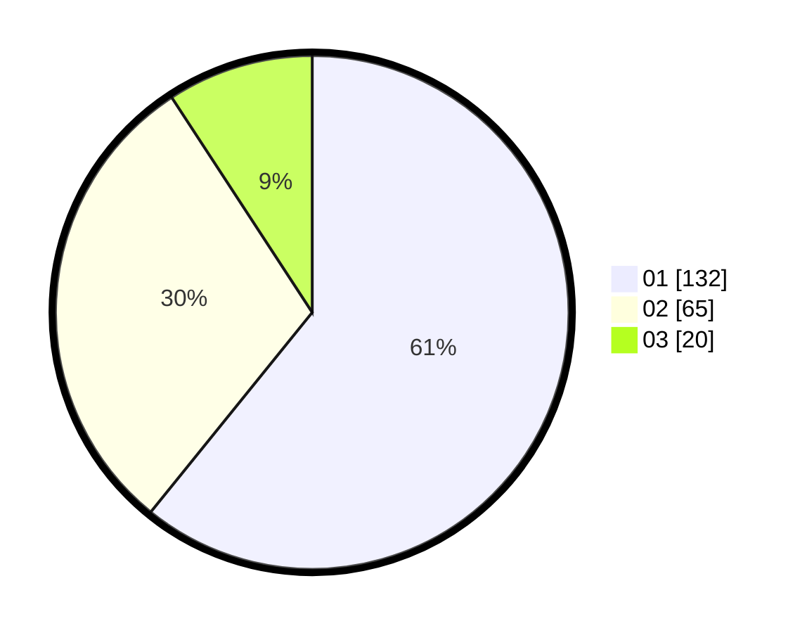

# Hasil

Hasil perolehan suara paslon dapat dilihat pada file paslon-01.txt, paslon-02.txt, dan paslon-03.txt.

Jika tidak ada, artinya data tersebut belum ada pada SIREKAP.

## Perolehan Suara

 * Paslon 01: **132**.
 * Paslon 02: **65**.
 * Paslon 03: **20**.

## Foto C Plano

https://sirekap-obj-formc.kpu.go.id/2e69/pemilu/ppwp/31/75/03/10/06/3175031006002-20240214-223803--86d3c474-81ce-4541-a215-3817619d4c9a.jpg

https://sirekap-obj-formc.kpu.go.id/2e69/pemilu/ppwp/31/75/03/10/06/3175031006002-20240214-223823--ed83613d-7a26-4b75-99ae-dd2c3386f1cf.jpg

https://sirekap-obj-formc.kpu.go.id/2e69/pemilu/ppwp/31/75/03/10/06/3175031006002-20240214-223840--005752b0-9df0-475b-bb67-20d2b5a6180a.jpg

## DATA PEMILIH TETAP

Jumlah pemilih dalam DPT: **284**.
 * L: **847**.
 * P: **134**.

## DATA PENGGUNA HAK PILIH

Jumlah pengguna hak pilih dalam DPT: **285**.
 * L: **196**.
 * P: **109**.

Jumlah pengguna hak pilih dalam DPTb: **575**.
 * L: **8**.
 * P: **888**.

Jumlah pengguna hak pilih dalam DPK: **881**.
 * L: **870**.
 * P: **881**.

Jumlah pengguna hak pilih: **257**.
 * L: **102**.
 * P: **119**.

## JUMLAH SUARA SAH DAN TIDAK SAH

JUMLAH SELURUH SUARA SAH: **217**.

JUMLAH SUARA TIDAK SAH: **0**.

JUMLAH SELURUH SUARA SAH DAN SUARA TIDAK SAH: **217**.
